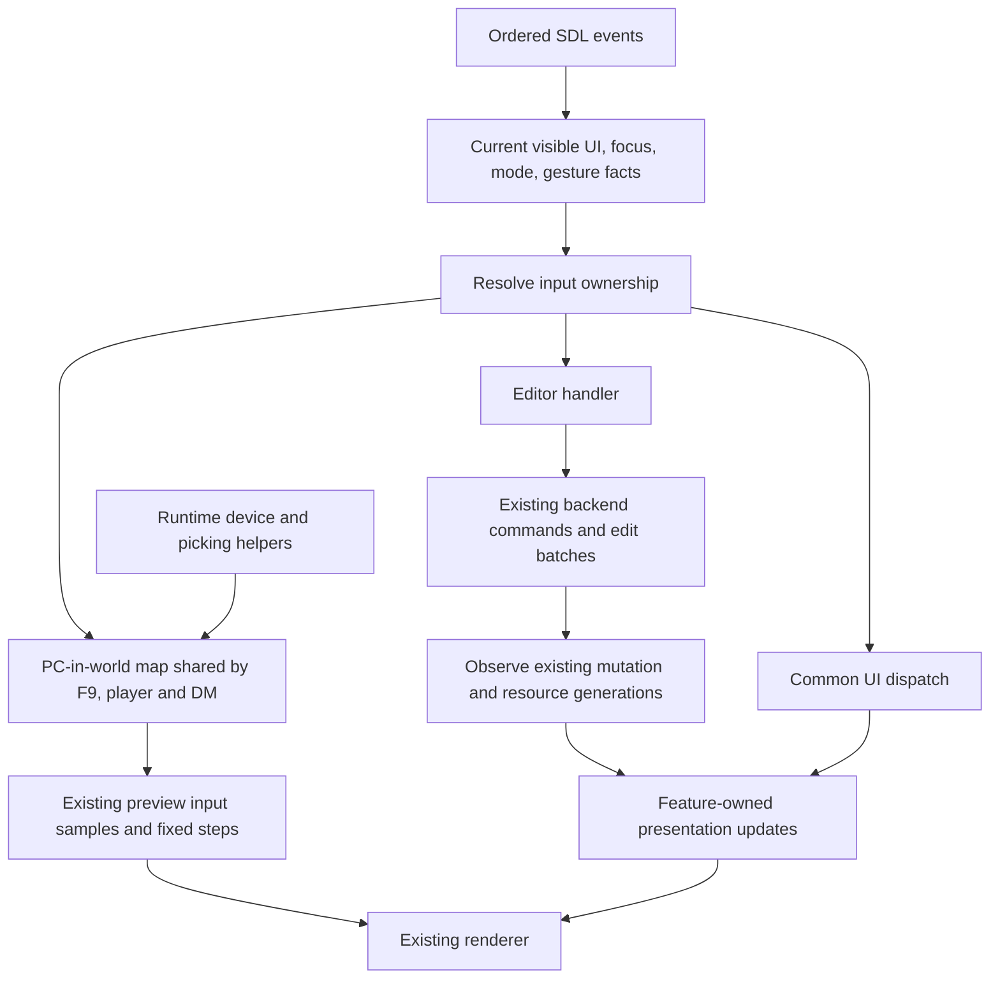

# Client main.cpp refactor

Status: closed; supported automated validation passed and user manual testing
accepted on 2026-09-17. Source baseline: `6182a1943`.
Actual checkpoints and validation are recorded in
[client-main-refactor-progress.md](client-main-refactor-progress.md).

## Intended result

`main.cpp` selects CLI or desktop startup. The application coordinates existing
systems. Each feature owns its presentation and transient state. Input has one
ordered routing boundary and two control maps: editor and PC in the world.
F9 supplies the working PC controls and remains an editor-owned preview lifecycle.
Player and DM share the PC map; DM adds access to panels and actions.

The important result is being able to fix tile input without reading command
forms, inventory drops, player movement, and output selection together. File
size is secondary to removing those dependencies.

Read this plan in three parts: the architecture and ownership contracts; the
ordered extraction checkpoints; and the validation gates. The source anchors
refer to the baseline, not to line numbers after files start moving.

## Frame, platform, and limits

This is Tier 2: reorganizing application state, presentation, input routing,
and lifecycle across subsystem boundaries. The problem is that an editor
change currently requires reasoning about unrelated input and refresh paths.
Success means those paths can be changed and tested locally while preserving
the working client.

The platform is the existing desktop SDL3/RmlUi/Vulkan client. Live kernel
objects, UI dispatch, and rendering run on the main thread. RmlUi callbacks
are synchronous and can change focus or commit an edit during dispatch.
Documents, generated textures, font buffers, and backend bindings have
lifetimes that extend beyond individual calls.

The client will also support player and DM modes. Both control a PC in the world
using the same keyboard/mouse/controller map. DM differs in available panels and
actions, not locomotion policy. This refactor establishes that shared PC map and
its boundary with editor input and UI ownership. F9 provides the existing path
to extract; authentication/networking and new DM panels are separate features.

Use successive, buildable commits. If an extraction needs a broad interface
or changes behavior, reduce its scope and characterize the disputed path
first. Do not move the entire file into a replacement application.cpp.

## Patterns & Conventions Found

Measured source inventory at the baseline:

| Source | Observed size or responsibility |
| --- | --- |
| `tools/client/main.cpp` | 16,926 lines |
| `main.cpp:13080` | `main` spans 3,847 lines |
| `main.cpp:970` | `AppState` spans 333 lines, with 152 `viewer_fps_*` fields |
| `main.cpp:13434` | SDL event intake and editor/runtime/modal dispatch |
| `main.cpp:16188` | Default Rml dispatch after native handlers |
| `main.cpp:16213` | Mutation observation, scene refresh, and workbench rebuilding |
| `main.cpp:16574` | Frame rendering, layout completion, and hover updates |
| `main.cpp:16893` | Explicit shutdown sequence |

Existing modules already contain the substantive operations:

- `tools/client/area_tile_brush.hpp`, `area_tile_edits.hpp`, and
  `area_tile_interaction.hpp:44`: validated tile batches and pointer policy.
  Extract their UI coordinator; do not write a second painter.
- `tools/client/preview_session.hpp:40`: runtime input samples and fixed-step
  preview simulation. Extract device translation and client lifecycle;
  retain the existing simulation, navigation, and door interaction.
- `tools/client/toolset_backend.hpp:52`: command execution, document opening,
  tile edits, object placement, and blueprint update jobs.
- `tools/client/workspace.hpp` and `shell_controller.hpp:16`: document/undo
  ownership and shell state. Do not replace either with new controllers.
- `tools/client/workspace_view.cpp:13`: existing Rml presentation module.
  Extend it rather than adding a parallel workspace presenter.
- `tools/ui/virtual_combobox.hpp`, `virtual_list.hpp`, and
  `rml_managed_list.hpp`: shared control infrastructure. Every extracted
  view continues using these controls.
- `tools/client/renderer.hpp:42`, `viewer_viewport.hpp`, and
  `viewport_pointer_drag.hpp:25`: renderer boundary and gesture validation.
  Camera mathematics and scene ownership stay in their existing modules.
- `lib/nw/render/viewer/session.hpp:59`: existing renderer statistics.
  Avoid another counter-by-counter statistics representation where these
  values can be read directly during the HUD update.
- `tools/client/workspace_view.cpp:21` already uses
  `Rml::StringUtilities::EncodeRml`; compare its escaping with the local
  helper before replacing duplicate encoding code.

Build conventions: pure client operations live in `rollnw_client_core`;
SDL/Rml application code is compiled into the executable. Tests already
compile selected presentation sources under the Rml target guard in
`tests/CMakeLists.txt:411`. Follow that arrangement initially.

Keep paired .hpp/.cpp files, existing namespace and naming conventions,
clang-format, designated initialization, and existing status/diagnostic
models. No `std::map`; use contiguous arrays, or existing Abseil containers
when a lookup genuinely needs one. C++ gains no propset initialization or
rule ownership from this refactor.

## Actual data and costs

Input consists of ordered SDL events, current Rml focus and visible hit
targets, the active workspace document, borrowed engine identities, existing
mutation/resource generations, and renderer frame statistics. Output consists
of input disposition, existing command invocations or preview samples,
presentation updates, and renderer requests.

There is one displayed viewport and three Rml contexts: toolset, FPS overlay,
and command overlay (`main.cpp:13255`). SDL text is borrowed for dispatch.
Native dialog results are owning heap payloads transferred through an SDL user
event: the callback frees them if enqueueing fails, and the UI handler frees
them after delivery (`main.cpp:1791`, `main.cpp:12476`). These are different
lifetime contracts and must not be flattened into one borrowed event row.
Tile indices and selection arrays already use contiguous, validated batches.
Virtual lists materialize viewport ranges rather than all source rows.

Valid ranges and rejection behavior remain those of the existing operations:
positive viewport dimensions, finite pointer values, valid row indices,
matching object/resource generations, and compatible tile batches. Invalid
input cannot invoke an editor or runtime action. Missing/stale targets cancel
the affected gesture or return an explicit unavailable result.

Resource definitions and document identities are stable between generation
changes. Pointer position, modifiers, focus, selections, queries, and pending
runtime input can change at every event. Routing facts must be captured again
after an earlier event changes UI or mode; a once-per-frame snapshot is unsafe.

ASSUMPTION: pointer motion is the common high-frequency input case; actual
event rates have not been measured. This affects the no-allocation routing
contract, not a proposed optimization. Preserve existing frame-coalesced tile
hover updates and accumulated runtime look deltas.

Access pattern: SDL intake and pure routing rows are processed linearly;
device keys/axes use bounded indices; virtual views traverse their current row
window. DOM hit/focus work follows RmlUi pointers and is not converted into a
new indexed DOM. The native route normally retains the same map/gesture owner
across adjacent events; switches happen on edges/lifecycle changes.

ASSUMPTION: adjacent events commonly retain map/gesture state — affects the
expected branch predictability, not permission to reorder events. DOM hit cost
and branch entropy have not been measured. The design uses the existing desktop
main-thread constraints and adds no speculative cache/branch optimization.

Observed F9 overlap includes keyboard/gamepad movement, look and zoom sampling,
viewport rays, door picking, and click-navigation requests (`main.cpp:8001`,
`main.cpp:14348`). These existing paths are the source of shared runtime control
code, not a separate prototype to replace.

User requirement: player and DM both control a PC in the world. They share
device sampling, bindings, movement/look/zoom, picking and world interaction;
DM panel/action availability is separate from this map. No authentication change
is needed to extract or reuse those controls.

The pure routing transform is O(N) time and O(1) additional scratch for N
independent routing rows. DOM hit testing retains RmlUi's current cost; it
must not be claimed constant-time. No extra action queue, worker thread, or
per-event allocation is required. Feature arrays and renderer resources keep
their current owners rather than being copied through module boundaries.

The dominant engineering cost is review and regression validation across the
event and lifecycle boundaries. Estimate, not a measurement: 5–10 focused
working days for the complete sequence, revisited after the first extraction.
More translation units add build/link overhead and headers add maintenance
cost; narrow includes and existing build targets limit that cost. Runtime or
build-time speedups are unverified and are not acceptance claims.

Moving existing feature state is intended to change ownership rather than
duplicate its arrays/textures. The pure route adds bounded record scratch;
shared PC controls remove the need for separate player/DM binding and device
state. Exact sizeof/build-cost changes are measured during extraction, not
guessed here. This refactor has no measured throughput/latency optimization
target; its primary acceptance requirement is behavior and dependency clarity.

## Architecture Decision

Use a small composition root with feature-owned state and ordinary functions.
Separate presentation, input ownership, substantive edits, and application
lifecycle. Keep existing backend, workspace, renderer, and SmallS bridges.

Use three layers, each with an actual data responsibility:

1. Common UI routing determines visible modal/popup/text/gesture ownership.
   Player and DM can expose different panels through this same boundary.
2. Runtime device helpers normalize input and return viewport ray/hit data.
3. One selected control map interprets unclaimed input: editor or PC in the
   world. The PC map is shared by F9, player and DM, including controllers.

Client role and control map are different facts. The root derives the map from
the active control session; it does not maintain separately writable copies in
feature states. Editor with active F9 uses the PC map. Player and DM with a
live PC use that same map, while their visible UI differs. Actor picking, actor
placement, starting/stopping the detached preview, fixed-step catch-up and
restoring the editor remain F9 lifecycle operations outside the PC translator.

Common UI routing retains the current event-specific precedence: native results
and operation/form gates precede ordinary dispatch; F9/Escape lifecycle handling
has its existing priority over ordinary text and editor controls. Input owned by
the PC map must never fall through into editor painting, placement or selection.
DM panel input is owned by that visible panel before world input is considered.
Camera commands remain data passed to the existing camera implementation;
the PC map has one binding policy across player and DM.

Use static calls and a small control-map switch, not dynamically registered handlers,
inheritance, plugins, or a generic event bus. RmlUi's required EventListener
adapters remain thin adapters to ordinary functions. There is no separate DM
movement handler or empty DM stub. Unknown maps or a missing active PC/session
return unavailable, never an editor fallback. Adding DM panels later does not
require copying or branching the PC controls.

## Component Design and Implementation Map

Each feature header declares its owned state and a small integration API.
Internal render/commit helpers remain private in the corresponding .cpp.

| Files | Responsibility, reuse, and integration |
| --- | --- |
| New `tools/client/client_metrics.hpp/.cpp` | HUD state, smoothing, formatting, and GPU timing scopes. Consume existing renderer statistics; preserve labels and timing semantics. |
| New `tools/client/client_preferences.hpp/.cpp` | Preference path/load/save, borrowing DockLayout and recent-project rows. Reuse existing project preference parsing and atomic JSON saves. |
| New `tools/client/client_cli.hpp/.cpp` | Version/build info, init/import commands, kernel setup for CLI work, and CLI exit codes. Preserve the no-window path. |
| New `tools/client/command_view.hpp/.cpp` | Palette, command forms, shared combobox presentation, blueprint review/progress markup, focus restoration, and result presentation. Backend continues owning command and job execution. |
| New `tools/client/project_loading_view.hpp/.cpp` | Native dialog result lifetime, import presentation, queued project opening, and synchronous load-progress presentation. Reuse ProjectImportJob and current load progress sink. |
| New `tools/client/shell_view.hpp/.cpp` | Dock sizing, output selection/scroll, terminal presentation, and captured log draining. ShellController retains shell data and output policy. |
| New `tools/client/project_browser_view.hpp/.cpp` | Tree rows, collapsed-node state, filtered identity, and browser virtual windows. Project/backend continue supplying resource data. |
| Extend `tools/client/workspace_view.hpp/.cpp` | Tabs, home cards, active-content rendering, and tab scrolling/reordering. Delegate object and tile content to their owning views. |
| New `tools/client/object_workbench.hpp/.cpp` | Details/variables, workbench surface selection, object activation/clearing, SmallS refresh coordination, and change/blur adapters. Reuse ObjectDetailsSnapshot and existing command results. |
| New `tools/client/creature_workbench_view.hpp/.cpp` | Classes, feats, spells, filters, and their virtual windows. Retain existing SmallS presentation providers. |
| New `tools/client/inventory_workbench_view.hpp/.cpp` | Inventory grids, equipment, managed-list presentation, and selection. Reuse existing item/model/list infrastructure. |
| New `tools/client/appearance_view.hpp/.cpp` | Appearance/color/sound catalog selectors and body preview coordination. Retain shared combobox and catalog implementations. |
| New `tools/client/area_tile_editor.hpp/.cpp` | Palette, Shift hover/selection, stroke lifetime, previews, rotation, variation, and commit/cancel. Reuse all existing tile operation modules. |
| New `tools/client/area_object_editor.hpp/.cpp` | Area object drag/placement, region drawing, door hook snapping, encounter points, and edit gestures. Reuse existing validation and transactions. |
| New `tools/client/project_resource_drag.hpp/.cpp` | Project-to-inventory/spawn/sound/store drops, ghost lifetime, targets, and commit/cancel. Move the existing drag path without replacing it. |
| New `tools/client/runtime_input.hpp/.cpp` | Device normalization, pointer accumulation, viewport rays and door hit data extracted from F9. Reuse renderer hit APIs; return data without owning a control map or session lifecycle. |
| New `tools/client/pc_input.hpp/.cpp` | The shared PC-in-world control map: keyboard/mouse/controllers, movement/look/zoom and door/navigation intent. Used first by F9 and later by player and DM with the same bindings. Initially produce existing PreviewInputSample; UI role does not duplicate this map. |
| New `tools/client/editor_input.hpp/.cpp` | Editor control map delegating to tile, area-object, workbench and camera operations after common UI ownership has been resolved. |
| New `tools/client/play_preview_view.hpp/.cpp` | F9 picker/drop/start/stop, detached actor lifetime, overlays, fixed-step coordination and rendering attachment. Consume shared PC input and existing preview_session operations. |
| New `tools/client/client_input_routes.hpp/.cpp` | Flat, testable routing rows and results; no SDL/Rml/kernel ownership. Put the pure transform in rollnw_client_core. |
| New `tools/client/client_input.hpp/.cpp` | SDL event intake, visible/focused Rml target classification, ordered dispatch, derived editor/PC map integration and ordered Rml forwarding. |
| New `tools/client/client_runtime.hpp/.cpp` | SDL/window/Rml resource ownership, fonts, file interface, listener registration lifetime, startup failure cleanup, and shutdown ordering. |
| New `tools/client/client_application.hpp/.cpp` | Root state composition, job polling, mutation synchronization, frame stages, and calls into feature APIs. It must not contain extracted feature bodies. |
| Modify `tools/client/main.cpp` | Keep entry/CLI selection and application startup only. |
| Modify `tools/client/CMakeLists.txt`, `tests/CMakeLists.txt` | Add moved sources to the appropriate existing targets; preserve client-disabled and optional-Rml build configurations. |
| New `tests/rollnw_client_input.cpp`, `tests/rollnw_client_application.cpp` | Production routing/adapter and state-transition regressions, with no desktop window. |

This file count is a destination map, not permission to create placeholder
modules. Create each pair only with its extracted implementation. Existing
workspace_view, dialog_view, item_editor, renderer, and tools/ui modules are
extended where they already own the data. Do not add a catch-all utils module;
use RmlUi utilities or keep helpers private until actual shared callers need one.

Ownership: the root and its feature states have stable addresses after backend
and texture binding. Views borrow documents only for the call, or explicitly
for a registered listener's lifetime. Generated texture collections remain
feature-owned until unbound/released. Engine ObjectHandles remain the existing
validated identity protocol at cold boundaries; processing still uses indices
and spans. RmlUi pointers are required by its DOM API, not a new pointer-heavy
engine transform.

Errors: existing command/edit status and diagnostics cross feature boundaries.
Routing returns a disposition and reason; it does not throw or perform an edit.
Startup failures return the existing exit status and unwind initialized
resources. No duplicated success flags or second mutation queue are introduced.

### Extraction inventory

These are function families to relocate, not instructions to move contiguous
line ranges blindly. A helper moves to its actual owner; a genuinely shared
helper stays at the narrowest existing common boundary.

| Baseline family | Destination and boundary to expose |
| --- | --- |
| Preference helpers, `main.cpp:1326–1478`; CLI, `12916–13074` | `client_preferences`, `client_cli`; filesystem/configuration inputs and explicit result/exit status. |
| Dock/visibility helpers, `1480–1704`; output/terminal helpers, `2844+` | `shell_view`; shell data, DOM layout, output selection and scroll policy. Preview chrome visibility is supplied by the root. |
| Dialog callback, `1791`; result handler, `12476`; import/open polling and progress, `12723–12881` | `project_loading_view`; owning native results, current request generation, existing job results, narrow synchronous presentation callback. |
| DOM hit/focus helpers, `1941–2072`; event fallback, `16188` | `client_input` or private owning-view helpers; visibility-aware classification and ordered Rml forwarding. |
| Recent/project tree helpers, `3140+`; home/tab markup, `3500+` | `project_browser_view` and existing `workspace_view`; resource rows versus document/tab presentation remain distinct. |
| Details/variables, `3923–4414`; listener, `8905–9092` | `object_workbench`; snapshots, row editors, pending slider edit, Enter/blur sequencing, active object identity. |
| Feats, `4415–4592`; spells, `4593–4887`; creature hydration, `6747+` | `creature_workbench_view`; queries, row ranges, class/feat/spell presentation and SmallS refresh calls. |
| Inventory, `4888–5041`; item/equipment markup near `6906` | `inventory_workbench_view`; item icon cache, pages, selections, existing managed-list render state. |
| Appearance, `5042–5422`, `5906–6250`; sounds, `5423–5591`, `5880+` | `appearance_view`; catalog generations, selector queries, popup state and temporary body preview identity. |
| Tile palette, `5592–5880`, `7109+`; tile orchestration, `9669–10650` | `area_tile_editor`; palette, selection, stroke, feedback, retained preview rows and coalesced hover state. |
| Area drag/snapping, `9231–9667`; placement/regions, `10652–11077` | `area_object_editor`; stable target identity, before/preview spatial rows, hook/navigation snapshots, commit/cancel. |
| Cross-panel project drops, `11079–11705` | `project_resource_drag`; source ownership, threshold, target indices and existing drop transactions. |
| F9 lifecycle, `7768–7974`; sampling, `7976–8057`; viewport event branches, `14348+` | `play_preview_view`, `runtime_input`, `pc_input`; lifecycle, device data and the shared PC map are separated. |
| Metrics, `8059–8706`; timing scopes in the frame loop | `client_metrics`; existing counter values, smoothing histories and formatter. Move first; remove mirroring separately. |
| Palette/forms/results, `8708–8904`, `11810–12475`; action listeners, `12602+` | `command_view`; existing CommandPrompt, combobox state, operation generations, focus restoration and command results. |
| Key helpers, `11707–11808`; SDL switch, `13434–16211` | Selected input owners plus `client_input`; retain each branch's relative order during relocation. |
| Shared workspace refresh, `7559–7712`; mutation handling, `16213+` | `workspace_view`, `object_workbench`, application stages; one content path, distinct activation and mutation refresh. |
| Startup, `13080+`; frame coordinator, `13404+`; shutdown, `16893+` | `client_runtime`, `client_application`; resource lifetimes and stage ordering, with no feature algorithms embedded. |

### State ownership

Move state with the functions that write it. The root owns these feature states
directly at stable addresses; it does not maintain parallel copies of their
active flags, selections, caches, or observed render generations.

| Data currently embedded in AppState or listeners | Final owner and lifetime |
| --- | --- |
| Backend, workspace, shell and SmallS bridge | Existing owners composed by the root; bindings established after addresses are final. |
| Command form, combobox, browse/render generations, review page, palette focus restoration | Command view for the application lifetime; form content is generation-scoped. Backend owns blueprint execution. |
| Details/variables, active object tab, surface and row windows | Object workbench; active identity invalidates object-specific snapshots. Workspace remains document authority. |
| Feat/spell/class snapshots, filters and popup windows | Creature workbench; mutation refresh preserves current filters where the baseline does. |
| Inventory pages/selection, item icons, managed-list render state | Inventory workbench; texture collection address remains stable for bridge binding. Shared reorder gesture state belongs to input interaction ownership, not a second list implementation. |
| Appearance/sound catalogs, generations, filtered indices, selectors, color/body-preview targets | Appearance view; catalogs are resource-generation scoped, body-preview restoration happens before kernel shutdown. |
| AreaTileEditorState including visited masks, preview rows, seeds and selection | Tile editor; stroke target/generations are fixed until commit/cancel, hover presentation remains frame-coalesced. |
| AreaObjectDragState and AreaObjectPlacementState | Area object editor; captured document/object identities remain fixed until commit/cancel. |
| ProjectBlueprintDragState | Project resource drag; source/temporary object lifetime is released by exactly one commit/cancel path. |
| PlayPreviewState session, fixed-step state, tick buffers, area/tab/generation, actor picker | Play preview lifecycle; detached actor and visual attachment remain owned here. |
| Gamepad connection, look/wheel accumulation | Runtime input acquisition; the shared PC map consumes it independently of detached preview lifetime. Preserve current connection and reset behavior. |
| Dock resizing, output selection/scroll, terminal suppression and hover | Shell/input state according to actual writers; presentation reads the corresponding state rather than copying it. |
| Tab scrolling/dragging, home cards, project tree/filter/collapse state | Workspace view and browser view respectively; backend still owns resource definitions. |
| Import job, project-open request, native-dialog command/event and status | Loading view; callbacks carry owned payloads, not pointers to a feature state. |
| 152 viewer_fps fields | Metrics state initially unchanged; later retain smoothing history and read authoritative current counters directly where equivalent. |
| Observed object/area mutation epochs, stale displayed area | Application synchronization state; feature-local rendered generations remain in their owners. |
| Viewport focus, camera drag, managed-list reorder and derived control map | Input coordination state; role/session remain root authority and target identities are validated by the relevant existing operation. |

The change listener also owns pending sound volume and blur-suppression state
outside AppState. Include both in the extraction. The pending edit currently
stores only row/current/desired values. Characterize object/tab switching during
that gesture before moving it; if an owner-identity defect is demonstrated,
fix it in a separate behavior commit with its own regression test.

### Dependency rules and integration APIs

Allowed direction: bootstrap → application/runtime → input and views → existing
backend/UI/renderer operations. Pure routing and pure device-to-intent transforms
depend only on flat records and existing math/protocol types. They never include
the application state, RmlUi, SDL window ownership, or ToolsetBackend.

Views do not include client_application.hpp, call the frame loop, or reach into
unrelated feature caches. Feature boundaries accept owned state plus the
specific existing dependencies they use. Stable references to SDL/Rml/renderer
singletons are integration borrows, not a new pointer graph in a hot transform.
Array work uses indices/spans; engine handles remain validated cold identities.

Planned public function families:

- Tile editor: render/synchronize palette, process tile pointer/key input,
  update retained previews, commit/cancel stroke, clear selection. Existing
  edit/brush operations still supply validated tile batches and diagnostics.
- Area object editor and resource drag: arm/update/commit/cancel their existing
  gestures. Keep their different storage and transactions; do not create a
  universal drag class merely because both cross a movement threshold.
- Workbench: activate/clear an object, refresh after mutation, synchronize row
  windows, process change/blur. Activation resets identity-specific state;
  mutation refresh retains allowed queries/selections.
- Command/loading/shell views: classify their visible input ownership, update
  their own DOM and report existing command/job results. Execution remains in
  ToolsetBackend or the existing job owner.
- Input: classify current facts, resolve route rows, dispatch ordered events,
  acquire runtime device data and translate shared PC samples.
- Runtime/application: initialize/shutdown one application and coordinate one
  frame. These are documented singleton operations; contained row transforms
  retain their plural paths.

Use existing CommandResult and mutation/resource generations for outcomes and
refresh requests. A view's local dirty state can change directly. Cross-feature
refresh is an explicit root call using those existing results; no generic effect
queue, new observer registry, or duplicated mutation epoch is introduced.

A temporary internal AppState header may support mechanical moves. Record every
remaining consumer in the checkpoint description. A feature is not finished
until its API stops taking the complete root; remove feature dependence before the final
root extraction; keep only private application composition declarations. Do not substitute a giant ClientServices/context bundle that
exposes the same state under a different name.

Build placement is explicit:

- `client_input_routes.cpp` and the pure `pc_input.cpp` translation belong in
  rollnw_client_core. Their headers/protocols contain no SDL/Rml dependencies.
- `runtime_input.cpp` acquires the physical PC keys/controller axes and performs
  existing renderer ray/hit queries. `client_input.cpp` coordinates UI ownership
  and ordered dispatch. These SDL/renderer adapters remain executable sources
  and are compiled into applicable tests under their existing target guards.
- Fixed physical-key/controller values cross into PC translation; W/S versus
  Q/E/A/D meaning exists once in pc_input. No arbitrary-device registry or
  configurable binding table is required for the currently observed controls.
- Views/runtime/application remain presentation/executable sources; selected
  production sources are shared with headless tests through existing CMake
  arrangements. No new dependency reaches into lib/nw rule or propset policy.

## Data Flow and Batch Contract



`resolve_client_input_routes(inputs, outputs)` uses borrowed contiguous spans
of equal length. A routing input row contains event category/edge, control map,
normalized target, focus category, and current modal/gesture facts. The output
at the same index contains native recipient, Rml recipient/forwarding phase,
and disposition/reason. Document layout/meaning as schema revision 1 in the
header; no per-row version field or serialization is required.

Each row represents an independently captured event context. No pointers,
strings, command closures, or engine objects appear in the pure routing row.
Unknown modes/values or invalid targets cannot produce a game/editor action.
Mismatched spans clear outputs to invalid input and dispatch nothing. Invalid
pointer values are rejected by the SDL adapter before DOM hit testing or
coordinate conversion.

The production event path processes ordered events through the same dispatch
path as a span of size one: capture facts, resolve, dispatch, then inspect the
next event. Batched tests cover multiple rows without freezing live UI state
for an entire frame. SDL text/native payloads are never stored in the row.

Lifecycle calls and device acquisition are documented singleton exceptions:
there is one application, displayed viewport, and selected control session.
Routing decisions, tile/list edits, navigation projections, and fixed-step
preview samples retain their existing plural paths.

Displayed-workbench activation, current tab/focus, popup ownership and context
layout are also true singletons: each selects or updates the one currently
displayed surface, rather than processing many independent surfaces. Their
internal row materialization/edit work remains indexed/batched. Do not introduce
artificial plural lifecycle APIs or a separate one-object edit implementation.

Important invariants:

- Preserve current precedence, including special F9/Escape/quit handling and
  preview actor placement, while extracting it. Enumerate legal overlaps
  before merging existing gesture flags into one owner representation.
- Hidden palette/dock/popup bounds never claim a hit. An FPS overlay does not
  claim input merely because it renders above the viewport.
- At most one RmlSDL forwarding call handles an event, whether it is an early
  release or the default path. Its return value retains its existing semantics;
  native handling is not conflated with it.
- A consumed action cannot be activated again by default Rml forwarding.
  Legitimate blur commits of the previous input still happen in their current
  order before a new object or tab takes ownership.
- A callback that replaces DOM or changes the active document invalidates old
  element pointers. Revalidate document/object identity and reacquire any DOM
  target needed afterward; routing rows retain no DOM pointers across callbacks.
- Common UI ownership does not mean mode-independent bindings: editor object
  radius/scale/rotation wheel actions do not run in the PC control map.
- Control-map/session transitions cancel owned gestures and discard pending
  click/look deltas using existing lifecycle rules. Capture current held-key behavior
  across F9 before changing it; do not silently redefine it during extraction.
- Routing never waits for rendering, performs navigation projection, or writes
  propsets. The chosen handler invokes the existing operation after routing.
- Hover coalescing does not drop stroke cells, button releases, or accumulated
  runtime look samples.
- CommandSpec.default_binding remains metadata. The existing hard-coded key
  policy is split by mode, not replaced with a second incomplete binding table
  (see `issues/client-keybinding-table.md`).

Application stages keep the current ordering: poll jobs and synchronize runtime;
dispatch events; observe mutations and refresh affected presentation; complete
the existing cursor/layout/UI work; sample/simulate/render the viewport; render
HUD and command overlay; present and pace. Stage labels do not authorize moving
individual calls: retain the pre-begin_frame tile-cursor flush, then the current
Rml layout/virtual-window passes and main-UI Render before PC sampling/viewport
simulation. Initially retain repeated Rml Update calls that complete layout;
remove one only after demonstrating that its consumers already see valid layout.

### Event dispatch contract

The current `dispatched_to_rml` flag means several different things: a native
action consumed input, an event was already forwarded, or a native handler
required an early Rml release. Replace that ambiguity with a small flat result,
not a hierarchy of handler objects.

| Routing output | Meaning and valid combinations |
| --- | --- |
| Native recipient | None, common UI/lifecycle, editor map or PC map. Player and DM use the same PC recipient. At most one native recipient. |
| Rml recipient | None, toolset context, or command context. FPS context is presentation-only. |
| Forwarding phase | None, before native action, or after native action. None requires no Rml recipient; a phase requires a valid recipient. |
| Disposition/reason | Explicit handled, forwarded, unavailable, or invalid result, with a bounded reason tag. No command strings or object pointers. |

The input row classifies only facts needed by current branches: event family,
edge/button/key role, derived control map, visible target/focus, operation/form/picker
state and captured gesture owner. Reuse existing object and gesture types where
they express the data; do not create a mirrored ObjectType enum. Unsupported
row tags fail closed for native actions. Unrecognized SDL platform events still
take the existing platform/Rml path; they are not confused with malformed rows.

The production sequence is:

1. Accept one borrowed SDL event. Consume owning native-dialog results through
   their dedicated handler and preserve terminal-toggle text suppression.
2. Validate current document/gesture identities and finite pointer coordinates.
   Cancel a stale gesture before querying its old target. Invalid pointer input
   dispatches no target action; release/cancel cleanup remains explicit.
3. Capture current visible hit/focus and mode facts, then resolve one row through
   the batch transform. Do not retain SDL text or DOM pointers in that row.
4. When an action replaces DOM, copy its required identity/value from the target,
   perform the required Rml release once, then revalidate the action identity.
   If the callback changed the document/target, reject the stale action.
5. Invoke the native owner or forward after it according to the route. Track the
   one forwarding obligation explicitly so an early release cannot fall into
   default forwarding again.
6. Preserve post-forward work: pending sound-volume gesture commit and output
   scroll observation. They run in the same cases as the baseline.
7. Complete any required layout, discard borrowed targets and process the next
   event using fresh facts.

`main.cpp:15136` already releases mouse-up before area tabs, palette folders and
other controls replace workspace markup. This ordering is mandatory. A rule
that forwards all events at the very end would regress it. Mouse-down also
blurs the previous variable input before target selection (`main.cpp:14221`);
that callback can mutate data and must precede the new selection as it does now.

Preserve these priorities before consolidating them:

| Event family | Baseline priority that needs characterization |
| --- | --- |
| All events | Stale-context cleanup → native dialog result → terminal suppression → blueprint operation/publication gate → command form gate. |
| Key down | Active/pending F9 preview consumes keys and handles F9/Escape/F8; picker and Tiles Escape precede ordinary focus checks; palette/selector/text commands precede tile/object/camera controls. |
| Key up/gamepad | Active preview consumes key-up; acquisition/removal is application device lifetime; preview cancel buttons become edge flags. |
| Mouse down | Prior input blur → existing right-button cancellations/region drawing → active drag threshold gates → visible palette/UI → viewport placement/PC/tile/object/camera handling. |
| Motion | Current captured gesture owns movement; otherwise preserve hover/selection/look updates and default UI forwarding. |
| Wheel | Gesture/modal ownership → visible popup scrolling → eligible focused closed-list cycling → viewport PC zoom or editor sound/object/camera edit → tab scrolling. |
| Mouse up | Finalize captured stroke/reorder/drop/placement/drag first; preserve early Rml release before native DOM-changing control actions; default forward only if still required. |
| Window/focus | Keep resize/pixel-size handling and current cancellation paths; permit Rml leave/layout handling without invoking world/editor actions. |
| Quit | Keep blueprint recovery/worker restrictions and dirty-tab save/discard/cancel behavior. Mode selection does not bypass command/job safeguards. |

This table summarizes observed order; ordered production tests must resolve
branch overlaps before a policy change. Do not replace it with one universal
“modal first, then text, then game” ordering.

### F9, player and DM boundary

Player and DM both move and interact as a PC. They use one PC-in-world map,
including controllers. DM-specific panel availability and panel actions are
additional UI ownership, not a second locomotion policy or controller mapper.

| Client/session facts | World control recipient | UI availability |
| --- | --- | --- |
| Editor, no active preview | Editor map | Current toolset panels. |
| Editor, actor picker/drop pending | Preview lifecycle handles the relevant placement/cancel input | Current picker/drop presentation; PC movement not active. |
| Editor, active F9 session | Shared PC map | Existing preview chrome/overlay behavior. |
| Player, live PC/session | Shared PC map | Player panels supplied by that mode. |
| DM, live PC/session | The same shared PC map | Player interaction plus DM panels/actions supplied by that mode. |
| Missing/stale PC/session or unknown map | Explicit unavailable result for world action | UI/lifecycle can still handle their own events. |

The latter two modes do not require authentication changes to extract this map.
This refactor supplies the input boundary, not their startup/session transport
or new panels. Future DM panel commands retain their own backend authorization;
that does not enter device sampling or movement translation.

Keep root role/session authority and derive a read-only control-map snapshot.
Do not set client role to player merely because the editor starts F9; its
detached preview instead selects the same PC map with a preview consumer.
Existing `CommandContext.play_preview_active` (`command_bus.hpp:115`) remains
derived from the actual preview session for compatibility. It is not a complete
player/DM UI or authorization model. Backend command guards remain authoritative.

Runtime data is device state, accumulated pointer deltas, viewport rays and
ordered hit rows. The shared PC map owns the current bindings:

| Input | Existing F9 interpretation to retain |
| --- | --- |
| W/S | Forward/back relative to actor facing. |
| Q/E | Strafe; A/D turn. One PC binding policy for both player and DM. |
| Arrow keys | Right minus Left is look X; Down minus Up is look Y. |
| Gamepad left stick | Normalized X is strafe; negated normalized Y is forward, with the existing radial deadzone. |
| Gamepad right stick | Normalized X/Y are camera look, with the existing radial deadzone. |
| Gamepad triggers/shoulders | Right trigger minus Left trigger, plus Right shoulder minus Left shoulder, produces held zoom. |
| Mouse wheel | Accumulate current SDL wheel Y as a zoom edge/delta. |
| Right/middle mouse drag | Both look in F9. Accumulated pixels use existing 0.0035 radians/pixel and 2.5 radians/second scaling. |
| Left viewport click | Interactable door intent; an open/non-interactable door falls through to existing navigation-ray projection. Latest pointer action replaces the pending one. |
| Gamepad East/Back | Pending cancellation edge. |

Acquire SDL keyboard/gamepad state once per selected PC sample, preserving
the current cadence. The SDL-facing PC adapter reads the relevant key indices;
runtime normalization helpers do not own the control map. Pure
translation uses flat sampled values and borrowed equal-length input/output
spans. Output is the existing PreviewInputSample, not a new generic gameplay
command language. Validate axes/times and reuse existing invalid-axis/deadzone
and fixed-step error policies.

Movement components retain the existing [-1, 1] clamp. Look and zoom can exceed
unit magnitude through combined inputs; do not add a blanket clamp. Negative
elapsed contribution retains the existing zero contribution, non-finite input
is rejected, and a missing/disconnected device contributes zero gamepad input.
Pointer hits require valid dense door indices and ordered finite bounds; reuse
the existing pointer-action setter's rejection and latest-action behavior.

`build_preview_tick_samples` remains the fixed-step transform: 60 Hz, at most six
catch-up rows, held axes in every row, click/cancel/zoom edges only in the first
emitted row. No emitted tick means the pending edge/deltas remain pending as
today. Do not clear them merely because the application rendered a frame.

Keep F9/Escape preview start/stop outside the shared map. A shared cancellation
intent, including its current controller edge, is interpreted by the actual
consumer; it does not mean that a live player/DM session must stop like preview.
Preserve today's F9 result without embedding detached-session teardown in PC
sampling. No new binding editor is needed: “control map” means the existing
fixed policy extracted into one owner, with a future remapping project separate.

DM can later add visible panels that claim pointer/text/reorder/edit input
through common UI routing. Unclaimed world input still reaches the exact same
PC handler. Panel focus/gestures cannot leak into PC clicks/look, and PC input
cannot accidentally reach editor painting. Any later possession or free-camera
feature gets its own explicit requirement; it is not needed for this map.

PC sampling must receive current UI ownership facts after event dispatch, not
only the physical SDL state. A consumed key event does not stop a held key from
appearing in SDL_GetKeyboardState. Visible text/modal/keyboard ownership excludes
the corresponding held input from the PC sample; pointer-owned panel gestures
exclude their look/wheel/click deltas. Gamepad input follows the same ownership
boundary where UI claims it. Hidden panels never suppress controls.

Do not disable all PC movement merely because the pointer passes over a panel:
pointer ownership and keyboard/controller ownership are separate facts. Suppress
only the claimed sources before the pure PC translation, discard claimed pending
edges/deltas rather than replaying them when a panel closes, and keep the one
existing binding implementation. This source eligibility is a small flat record
derived by input coordination, not a second command permission system.

Captured gestures retain ownership until release/cancel. Moving a PC look drag
over a panel does not transfer it to that panel; new pointer actions at the panel
are UI-owned. Test both cases instead of applying hit testing alone to every
motion sample.

A player/DM role change with the same live PC does not itself remap controls,
close a gamepad or stop a session. Recompute panel/focus ownership and cancel
only invalid captured interactions. A changed control map/PC identity still
uses the explicit transition/reset rules.

PC batch contract: input is a borrowed contiguous span of flat PcDeviceSample
rows, containing only the observed physical key/button values, normalized axes,
pending pointer sample, accumulated deltas/time and source eligibility. Output
is an equal-length borrowed span of existing PreviewInputSample rows; the caller
owns both buffers and consumes them before the next acquisition/reset. No SDL
pointers, live actor/propset ownership or DOM references cross this boundary.

`translate_pc_input_samples(inputs, outputs)` returns existing PreviewStatus.
Mismatched spans or invalid row values clear outputs and return invalid_input;
the caller dispatches none. Valid rows retain the current clamps/scaling/edge
rules and return ok. The production acquisition/session is a singleton, while
translation is the same plural path at count one. This API establishes shared
player/DM controls without introducing a new live-world command transport.

### Frame and lifetime contracts

Keep job polling before SDL intake; it can change documents/forms that the next
event must see. Preserve raw performance-counter frame time separately from the
existing 100 ms cap on millisecond camera input. Frame pacing remains conditional
on ROLLNW_CLIENT_UNCAPPED and the existing 16 ms target. Do not consolidate these
different time values into one “delta time.”

Project opening remains synchronous. Its progress callback presents on a stage
change or after 32 ms and calls SDL_PumpEvents, not the application event loop
(`main.cpp:12786`). The callback may update the load overlay and present; it must
not recursively poll jobs, dispatch edits, simulate preview, or start another
load. Its stack presentation record is borrowed only during open_project.
Rendering skips invalid/minimized windows through the existing checks. Moving
project loading to a worker is a separate measured requirement, not this refactor.

Resource acquisition and teardown are explicit singleton contracts:

| Resource | Ownership and teardown obligation |
| --- | --- |
| Kernel services and workspace documents | Root/runtime; stop preview and restore temporary appearance first, clear renderer/workspace objects before shutting down kernel services. |
| SDL/window and gamepad | Runtime/input acquisition; gamepad closed once, renderer destroyed before window, SDL_Quit last. |
| Rml file/system interfaces, resource directory and font bytes | Runtime; stable addresses and buffers until Rml shutdown. |
| Rml contexts/documents | Runtime owns three contexts; views/listeners borrow. Remove listeners and data models before contexts disappear. |
| SmallS bridge/backend bindings | Root-owned stable states; clear active object and shut down bound UI models before context/kernel teardown. |
| Generated icon/tile texture collections | Feature-owned stable containers; release Rml textures/compiled geometry while renderer is valid, then destroy renderer resources. |
| Native dialog payloads | Callback request/result ownership is explicit; failed enqueue frees immediately, delivered result is consumed once. Audit queued/late-result cleanup before introducing lifetime changes. |
| Import/blueprint workers | Existing job owner and quit rules; no runtime teardown while their existing publication/worker contracts forbid it. |

Normal shutdown retains the current order: cancel temporary drops/placement,
stop preview/close gamepad/restore body preview, wait for GPU, clear active bridge
state, release compiled Rml geometry/textures, remove listeners, shut down data
models, remove contexts/Rml, shut down renderer, clear workspace/kernel, destroy
window/SDL. Do not assume destruction order alone covers external bindings.

Some startup failures currently return after kernel/SDL/window acquisition
without the normal cleanup path. Mechanical extraction preserves the current
successful path; a separate checkpoint deliberately adds partial-initialization
cleanup and tests. Track acquired resources in the runtime owner and use one
explicit cleanup path, without a generic resource registry or mock production
renderer. Test failures after each actual acquisition boundary.

## Build Sequence

### 1. Capture contracts and extract low-risk leaves

- [x] Enumerate actual key/mouse/text/window/gamepad/native-dialog paths and
  precedence, including the F9 picker and placed-actor states.
- [x] Expose and test current hit/focus seams with visible and hidden overlays
  at the same coordinates. Record ordered-dispatch and no-brush Shift cases;
  add production tests as their coordinators become directly callable.
- [x] Extract metrics, preferences, and CLI paths with local dependencies.
- [x] Record CLI results and startup/shutdown resource order.

These first commits establish the extraction style without rewriting dispatch.

### 2. Extract area interactions, F9, and shared UI ownership

- [x] Extract command palette/forms and their focus/visibility helpers so input
  ownership can depend on one command-view boundary.
- [x] Move tile palette/strokes/selection/previews into area_tile_editor.
- [x] Move area placement, snapping, region drawing, and object gestures into
  area_object_editor; move cross-panel drops into project_resource_drag.
- [x] Extract runtime sampling/picking from F9 and one PC-in-world map used by
  F9, player and DM; test identical preview samples and pointer requests.
- [x] Move F9 lifecycle/render coordination into play_preview_view.
- [x] Keep the central routing order intact during these mechanical moves.

A temporary internal root-state header is allowed to make mechanical moves
buildable. It is not a final API. List its users and remove feature dependence
on the complete root before considering that extraction finished.

Tile fitting, navigation, camera mathematics, and door behavior are retained.
Editor and PC input become local while current control behavior stays intact.

### 3. Replace the central routing tangle with explicit ownership

- [x] Introduce the pure batch routing contract and production SDL/Rml adapter.
- [x] Move native handlers out of the giant event switch into their owners.
- [x] Separate editor and PC control maps. Player and DM select the same PC
  handler; role-specific panels use common UI routing. Unknown maps/stale world
  contexts have no editor fallback. Authentication is not part of this boundary.
- [x] Centralize default Rml forwarding and event disposition.
- [x] Remove scattered copies of modal, focus, hit, and mode gates only after
  equivalent production-adapter tests pass.

Extract first, consolidate second. No patch simultaneously moves handlers,
changes their precedence, and changes the substantive operation they invoke.

### 4. Finish presentation and move its state together

- [x] Extract loading, shell, and browser views; extend workspace_view.
- [x] Extract workbench, creature, inventory, and appearance presentation.
- [x] Relocate each feature's filters, virtual ranges, selectors, and render
  dirty state with its functions; keep list/combobox behavior unchanged.
- [x] Narrow APIs to owned state plus the existing dependencies they use.
- [x] Keep backend/workspace bindings and generated texture owners stable.

### 5. Remove duplicated refresh work

- [x] Merge the shared content-render path in refresh_workspace_content
  (`main.cpp:7559`) and refresh_workspace_view (`main.cpp:7672`). Full workspace
  refresh calls tab refresh plus the shared content path.
- [x] Preserve their intentional scroll/focus restoration differences explicitly.
- [x] Introduce one workbench activation transform for changing active object;
  mutation refresh remains a distinct path that preserves filters/selection.
- [x] Remove repeated configure/clear/hydrate sequences from input, rendering,
  and structural mutation handling.
- [x] Retain separate spatial, visual, and structural renderer update paths;
  do not rebuild the area for every change or replace them with a generic bus.
- [x] Finish narrow headers and remove the transitional monolithic state API.

### 6. Finish the root and lifecycle

- [x] Move startup/resource ownership into client_runtime with explicit cleanup
  after partial initialization and normal shutdown.
- [x] Move frame-stage coordination into client_application, delegating feature
  work. Preserve the synchronous project-load progress presentation path.
- [x] Ensure client_input delegates native feature actions to their owning views
  rather than retaining the old mouse-up chain or replacing main with another
  multi-thousand-line dispatch function. Routing, forwarding and effect ownership
  must be readable independently.
- [x] Reduce main to entry/CLI selection/startup. Target under 250 lines; target
  an application coordinator under roughly 700 lines. These are review guides,
  not reasons to hide code in includes or split functions arbitrarily.
- [x] Verify normal/sanitized builds and the integration matrix; commit each
  phase with its actual validation and any remaining limitations.

### Reviewable commit checkpoints

Each row is a buildable review boundary, not a promise to combine an entire
phase into one commit. Split a row further if preserving its behavior cannot
be reviewed locally. Do not combine a move with a precedence, camera, navigation
or edit-policy change. The checkpoint description names remaining transitional
root-state dependencies and the checks actually run.

| Checkpoint | Concrete change | Gate before continuing |
| --- | --- | --- |
| C01: baseline and input seams | Record source/build baseline; expose current hit/focus helpers without changing policy; record ordered-forwarding and Enter/blur characterization cases for their extraction gates. | Production hit/focus helpers tested headlessly; main behavior and build remain unchanged. |
| C02: metrics move | Move HUD state/functions and timing scopes unchanged. | Formatter output and counter/timer semantics preserved; client builds. |
| C03: preferences and CLI | Move preference and no-window CLI functions with their actual dependencies. | Existing CLI tests and version/build-info paths pass; preference load/save results preserved. |
| C04: command presentation | Move palette/forms/progress markup, popup/focus state and thin action listeners. | Hidden palette, modal controls, combo navigation and generation-scoped browse result tests pass. |
| C05: tile coordinator | Move tile palette, hover, selection, stroke and preview state; reuse operation modules. | Tile operations plus no-brush Shift, stationary rotation/modifiers, Escape and full-group preview cases pass. |
| C06: area object coordinator | Move object drag/placement, region drawing, door hooks and edit keys. | Drag identity/viewport tests, group/region validation and door placement/selection checks pass. |
| C07: resource drops | Move cross-panel drops and their temporary-resource lifetime. | Jitter versus intentional drag, valid/invalid/stale target, commit/cancel and list reorder isolation pass. |
| C08: shared PC controls | Extract normalization/picking and the PC-in-world map from F9, including keyboard/mouse/controllers. | Known device inputs produce baseline PreviewInputSample fields and fixed-tick edges; player/DM role cannot fork this map. |
| C09: preview lifecycle | Move F9 picker/drop/start/stop/visual attachment and fixed-step coordinator. | Detached actor lifecycle, facing-camera spawn, replacement doors, pending input and editor restoration pass. |
| C10: ordered input boundary | Move remaining SDL/Rml dispatch into explicit route/adapter, editor/PC maps and common UI ownership, then remove duplicate gates under tests. | One forwarding obligation, early release, hidden hit regions, held-input focus suppression, shared player/DM map and event-order suite pass; no replacement giant feature switch. |
| C11: loading presentation | Move native results/import/open polling and synchronous progress presentation. | Existing import/jobs, stale browse generation and load callback ordering pass; no recursive application dispatch. |
| C12: shell/browser/workspace | Move shell/browser state and extend workspace_view for tabs/home presentation. | Dock/output/terminal, tree filters, tab close/reorder and viewport layout cases pass. |
| C13: base workbench | Move details/variables, change/blur listener and activation state. | Enter/blur exactly once; pending sound slider edit and object/tab identity cases pass. |
| C14: creature view | Move classes/feats/spells and virtual windows. | SmallS/Rml expression and list/filter suites pass; C++ rule ownership unchanged. |
| C15: inventory view | Move inventory/equipment/icon state and presentation. | Item/model/list selection, texture binding and resource-drop regressions pass. |
| C16: appearance view | Move appearance/color/sound selectors and catalog generations. | Shared combobox, selectable heads, body-preview restoration and sound selector checks pass. |
| C17: shared refresh | Consolidate active-content rendering and workbench activation; keep mutation refresh distinct. | Focus/query/selection restoration and visual/spatial/structural refresh tests pass without a duplicate content rebuild. |
| C18: metrics simplification | Remove redundant current-counter mirrors only where direct existing snapshots are equivalent. | HUD values/labels remain equivalent; smoothing history and delayed GPU timing ownership preserved. |
| C19: runtime lifetime | Extract resource ownership, then add explicit partial-startup cleanup separately from the move. | Successful teardown order and acquired-resource failure paths pass; unresolved native callback lifetime is resolved or explicitly scoped. |
| C20: final composition | Extract frame coordination; reduce main; remove transitional state header/dependencies. | Full normal/sanitized integration checks, optional client configuration, dependency audit and acceptance matrix pass. |

C05–C09 are mechanical extraction checkpoints; C10 is the deliberate routing
consolidation. C13–C16 may need the temporary root header initially, but all
feature-facing root dependencies must be gone by C17. C19 may contain two
commits because partial-startup cleanup intentionally improves failure behavior.
Uncovered defects get a failing regression and a separate fix before proceeding,
rather than being hidden in the next move or recorded as a successful refactor.

## Simplification Summary and Transformations

Work to remove: duplicated content refresh, duplicated workbench activation, scattered
input-ownership gates, global visibility into unrelated feature state, and
unnecessary HUD field mirroring where existing statistics suffice.

Work to preserve: current controls, command/edit protocols, list/combobox infrastructure,
SmallS rule ownership, rendering order, preview simulation, and resource lifetimes.

Work to keep intentionally: synchronous Rml callbacks, borrowed DOM pointers, explicit
scene-update partitions, guarded job shutdown, and layout-completion passes.

Planned shape, not implemented code:

```cpp
// Before: native consumption and Rml forwarding share dispatched_to_rml.
// After: routing names the owner and the one ordered forwarding obligation.
const std::array inputs{capture_client_input_facts(event, current_ui, mode)};
std::array<ClientInputRoute, 1> routes{};
resolve_client_input_routes(inputs, routes); // production count = 1
dispatch_client_input(event, routes.front(), selected_handler);
```

```cpp
// Before: two workspace refresh functions each rebuild active content.
// After: content rendering has one path; tab refresh is explicit.
refresh_workspace_tabs(document, workspace_view, workspace);
refresh_workspace_content(document, workspace_view, active_content);
```

The simplification pass removes work rather than adding interchangeable
controllers: parse/fit/command modules are reused, gesture and list storage is
retained, and editor/PC dispatch is one static boundary. No generalized screen
framework, widget registry, configurable binding system, event replay storage,
or background UI thread is needed for this task.

Applied recursively:

| Simplification question | Decision and work removed |
| --- | --- |
| Not do it at all? | Reuse existing painters, preview simulation, backend commands, camera, lists and comboboxes. Player and DM share one PC map rather than separate movement/controller handlers. |
| Do it once? | One active-content rendering path and one activation transform; one route/forwarding obligation per event; authoritative existing frame-stat snapshots where equivalent. |
| Do it fewer times? | Keep hover/layout invalidation cadence and existing virtual row ranges. Do not regenerate palettes or rebuild the area because a module boundary changed. |
| Approximate? | No behavior approximation; this is a preservation refactor without a measured optimization requirement. |
| Small/large lookup table? | Use existing static enums/indexed controls only where actual data supports them. No handler registry or new keybinding table. |
| Buffer/FIFO? | Keep existing pending preview input, fixed-tick buffers and SDL native-result transfer. No extra command/event queue. |
| Constrain further? | One viewport, three UI contexts, main-thread UI/live kernel, editor/PC maps, common UI ownership, existing status/generation protocols and no new propset ownership. |

## Risk and No-Cleverness Findings

- [high] `main.cpp:13434`: implicit consumption and temporal precedence spread
  across the event loop. Simplify to explicit routing results and local mode
  handlers, validated at production entry points.
- [high] `main.cpp:13296` / `main.cpp:16893`: listener, model, texture, and context
  lifetimes depend on ordering. Keep the required order explicit in one runtime
  owner; test partial initialization and teardown, not merely compilation.
- [medium] `main.cpp:16213`: mutation, object activation, DOM replacement, and
  focus restoration are interleaved. Split orchestration from feature refresh
  and preserve focus as explicit input/output data.
- [medium] `main.cpp:7672`: a second content-render path duplicates the first.
  Share content rendering and expose meaningful restoration differences.

Overall risk is high at routing and lifecycle boundaries, lower for mechanical
presentation moves. Medium/high findings must be resolved or carry a concrete
reason for retaining their complexity. A smaller main with the same global
dependencies and implicit dispatch does not satisfy this plan.

## Critical Details, Verification, and Done

Add meaningful regression tests for boundaries that current operation tests
cannot cover. Reuse the existing headless RmlScope/NullRenderInterface pattern
in `tests/rollnw_client_rml_smalls_language_binding.cpp:50`, compile the production
helpers/adapters into tests, and feed ordered SDL events or routing rows through
those helpers. Test visible context recipients, command/edit counts, state
changes, and preview sample contents; do not test a duplicate policy in a mock.

The acceptance matrix includes:

- Hidden palette and bottom dock at former dead-zone coordinates do not block
  viewport clicks; visible modals and popup lists do block the appropriate input.
- F9 uses the visible viewport after shell chrome hides, including areas once
  covered by the output dock. Door clicks and open-door navigation keep working.
- Shift hover/select/variation works in Tiles without an active brush; R and
  stationary modifier changes refresh previews; Escape removes transient state.
- Group overlap, full-group erasing, raise/lower group rejection, undo/redo,
  camera movement during preview, and hover resource cleanup remain correct.
- Visible text focus suppresses ordinary gameplay/editor commands, with existing
  lifecycle/global-key precedence characterized separately; Enter/blur commits once;
  sound volume remains one undoable slider gesture; popup wheel selection and
  managed-list reordering keep their current behavior.
- Tab/object/project switches and focus loss cancel the correct gestures;
  stale resource generations never dispatch to a destroyed object or document.
- PC-map input never calls editor actions. Player and DM resolve the same world
  input to the same PC handler and sample; DM panel visibility changes UI
  ownership, not world bindings. F9 entry/exit resets pending state and restores
  current focus/camera behavior through its separate lifecycle.
- Device and pointer samples passed through the PC handler produce the same F9
  intents as the baseline; runtime helpers and PC translation contain no editor
  action or detached-preview teardown dependency. Controllers use this same map.
- Import/blueprint jobs, loading feedback, quit/save/discard/cancel, and CLI
  version/build-info/init/import preserve their current results and shutdown rules.

### Test ownership and assertions

Tests check the production boundary and its effects, not just an enum lookup
that duplicates the implementation. Extend existing fixtures where possible;
create the two new client test files only for genuinely new boundary coverage.

| Proposed coverage | Production path and evidence |
| --- | --- |
| Pure routes | Equal-length batches containing each valid owner/map/edge, malformed tags and mismatched spans. Assert recipient, forwarding phase and explicit rejection; player/DM role selects the same PC recipient, and output rows cannot retain previous valid actions. |
| Visible hit/focus | Load actual client Rml templates with the existing NullRenderInterface fixture, complete layout, compare the same point with palette/dock/popup visible and hidden. Assert viewport/UI recipient and visibility-aware text focus. |
| Ordered forwarding | Mouse-down/up followed by a tab/surface/folder DOM replacement. Assert one Rml release, one activation, no retained old DOM target and correct new document identity. Include a blur callback that changes the target before selection. |
| PC sampling | Fixed sampled keyboard/gamepad values, missing device, deadzone boundaries, combined axes, mouse elapsed time, wheel and latest door/target click. Assert every changed PreviewInputSample field and fixed-tick edge behavior; role does not change translation, and focused UI suppresses owned held input without needing another key event. |
| Mode/lifecycle | Editor → picker → placement → active F9 → editor; rejected spawn/start, Escape/F9, project/tab switch and disconnect. Assert no editor action during PC ownership, correct device/edge reset and detached actor restoration. |
| DM/player UI boundary | With identical active-PC/device facts, show/hide a representative panel through actual shared UI infrastructure. Unclaimed input produces the same PC intent; focused/captured sources stay UI-owned. Hovering a panel blocks pointer actions without blanket movement suppression. No DM startup/authentication implementation is needed to test this boundary. |
| Gesture ownership | Tile stroke, object drag, cross-panel resource drop, managed-list reorder, viewport camera drag and output selection. Assert arm/jitter/threshold/update/release/cancel transitions; stale document/generation cannot commit. |
| Workbench change | Multiple slider changes followed by release or blur produce one undoable edit; Enter then blur produces one variable command. Switch object/tab during pending input and assert the verified owner policy. |
| Refresh partitions | Same-object mutation preserves filters/selection; new-object activation resets only its identity-specific state. Assert shared content path is called once per requested refresh and spatial updates do not force structural scene rebuilds. |
| Resource lifetime | Repeated activation/preview/gesture cancellation and runtime teardown. Use existing object/cache/renderer counters and sanitizer evidence; counts return to their defined persistent baseline after temporary state is removed. |
| Startup failure | Failure after each actual acquired-resource boundary. Use real cleanup state and existing headless resource fixtures; assert only acquired resources are cleaned and required ordering is retained. Boundaries requiring an unavailable SDL/GPU fixture remain explicitly unverified. |
| Jobs/native results/CLI | Existing import and blueprint fixtures plus delivered/canceled/error/stale-generation result cases. Assert payload consumed once, correct result/exit code and preserved job/quit restrictions. |

The test target currently compiles selected presentation sources, not
RmlUi_Platform_SDL.cpp. Add moved production adapter sources and that backend
only under the existing Rml/SDL target guards, with SDL3 compile definitions
matching the client. Avoid duplicate source linkage and a new all-client library
introduced solely to make the tests convenient.

RmlSDL mouse-motion forwarding queries SDL window pixel density. A nullptr
window is not a faithful motion fixture. Pure routes and DOM classifiers can
run with NullRenderInterface; end-to-end SDL forwarding needs a valid non-desktop
SDL test window/driver or must be reported as unverified integration coverage.
Verify that fixture against the configured SDL backend before claiming coverage.
GPU scene tests use the existing headless Vulkan fixture. No desktop client,
GUI automation, or screenshot capture is launched as part of this plan.

Coordinate conversion is a preservation boundary too: current
`to_context_point` is identity (`main.cpp:2462`), while RmlSDL performs its own
density conversion. Record both paths and test their current agreement on the
supported configuration. Do not introduce a DPI conversion, viewport-origin
adjustment or camera correction as an incidental extraction.

### Validation commands and reporting

Commands below are implementation gates, not checks run for this document.
Use the existing configured builds; do not replace their flags opportunistically.
The combined sanitizer tree is build-ci-linux-clang-asan-ubsan; build-asan alone
does not enable UBSan in its current cache.

```sh
cmake --build build --target rollnw-client rollnw_test -j4
./build/tests/rollnw_test --gtest_filter='ClientAreaTileEdits.*:ClientPreview.*:ClientViewportPointerDrag.*:ClientViewerCameraStates.*:ClientWorkspace.*:ClientRmlTemplates.*:ClientVirtualComboBox.*:ClientRmlManagedList.*'
```

Add the new boundary suites to the relevant focused filter once they exist.
The existing GPU regression gate includes:

```sh
./build/tests/rollnw_test --gtest_filter='RenderViewerPreparedDraws.AreaTilePreviewRepositionsRetainedModelRows:RenderViewerPreparedDraws.EditableAreaDoorsKeepSelectionGeometryAtLiveTransform:RenderViewerPreparedDraws.WorkspaceDocumentsSurviveSceneSwitchesAndRebuilds'
```

Final integration uses the configured CTest shards and combined sanitizers:

```sh
ctest --test-dir build --output-on-failure -j4
cmake --build build-ci-linux-clang-asan-ubsan --target rollnw-client rollnw_test -j4
ASAN_OPTIONS=detect_leaks=0 UBSAN_OPTIONS=halt_on_error=1 ./build-ci-linux-clang-asan-ubsan/tests/rollnw_test --gtest_filter='Client*.*'
```

Run relevant GPU ownership/preview tests under combined sanitizers as supported,
and report skipped/unsupported cases explicitly. Build the core/test paths in
an existing compatible client-disabled configuration, or a separate configured
tree with renderer disabled; ROLLNW_BUILD_CLIENT is derived by CMake and is not
a standalone switch to force off. Keep unrelated benchmark configuration intact.

For each checkpoint report changed ownership/API, actual tests/counts and
remaining coverage gaps. Run focused checks once after the change and repeat
only when new changes/failures justify it. The full suite is the final integration
gate, not something to repeat for every mechanical helper move.

Human review of the running client's control feel remains necessary where a
headless assertion cannot establish it: camera navigation, group ghost clarity,
popup/reorder feel, F9 transitions and high-DPI pointer agreement. This does not
require the user to recheck every combobox; shared production-control tests cover
that infrastructure, with a small integration check of its owning views.

Run affected existing suites after each move: ClientAreaTileEdits, ClientPreview,
ClientViewportPointerDrag, ClientViewerCameraStates, ClientWorkspace,
ClientRmlTemplates, ClientVirtualComboBox, and ClientRmlManagedList as appropriate.
Run actual headless Vulkan renderer regressions for tile leases/door selection,
then the full configured test suite and normal/sanitized client builds at the
final integration gate. A skipped GPU test is not a passed renderer check.

The baseline sanitizer run passed the 29 tile cases with leak detection disabled,
but LeakSanitizer reported 5,417,704 bytes in VM initialization even with zero
selected tests. Keep this limitation separate from refactor validation; do not
claim a clean leak check or silently expand this refactor into VM repair.

Performance verification is a regression check, not an optimization project:
record source sizes, include dependencies, and representative incremental build
cost before/after. Retain the existing hover cadence and frame timing counters;
investigate any observed latency/resource-growth regression. No speedup is
claimed until measured.

Done means main/root contain only coordination, feature APIs do not expose the
complete AppState, all mode ownership decisions have one authority, the existing
operation modules remain authoritative, and the acceptance matrix passes with
skips/unverified manual checks reported explicitly. Any changed key semantics,
missing click, double commit, new editor fallback, or shutdown resource error
falsifies behavior preservation and blocks completion of the affected phase.

### Open questions and stop conditions

Keep unresolved questions here under issues/, rather than creating GitHub
issues or scattering TODOs through moved code:

- Later DM panels/actions: which existing panels are reusable and which world
  actions require server authorization. Does not change the shared PC map or
  block this refactor; new authentication, possession and free-camera features
  need their own explicit scope.
- Native callback lifetime: application-owned requests/results now use the
  shared delivery gate and pre-SDL-shutdown queue drain; callbacks borrow no
  AppState or DOM. Production closure/late-result tests establish that contract.
  Vendored SDL thread completion remains explicitly scoped in
  [client-native-dialog-sdk-shutdown.md](../client-native-dialog-sdk-shutdown.md).
  The Unix Zenity thread frees SDK data after the application callback; no
  synchronous completion or vendor cleanup guarantee is claimed.
- Pending slider owner: characterized and repaired in separate commits; live
  identity/generation/row/value checks reject replacement owners. Evidence is in
  [client-sound-slider-owner.md](client-sound-slider-owner.md).
- Headless forwarding fixture: real dummy SDL window established density-1
  motion forwarding and context recipient checks. User manual testing was
  accepted on 2026-09-17; detailed high-DPI/controller/GPU coverage was not
  itemized. The desktop validation issue retains the targeted coverage checklist.
- CLI cwd package policy: existing duplicate roots/reload loss are observed and
  scoped in [client-cli-package-paths.md](../client-cli-package-paths.md).

Stop and reduce scope if the proposed feature API needs the whole AppState,
requires a new general event bus, cannot preserve early release/blur ordering,
or needs new navigation/camera/edit behavior to pass. Plan B is the smaller
mechanical extraction with its current ordering and a focused characterization
test, not a second architectural framework.

### Final self-check for implementation

- [x] Source/data/cost assumptions are still accurate after the first extraction.
- [x] Pure routing uses bounded flat rows without allocations; adapters add no
      unnecessary payload copies, and external DOM/device/renderer borrows have
      explicit lifetime justification.
- [x] Feature state has one owner; narrow APIs and allowed include direction are
      enforced; the transitional feature API is gone; composed state remains private to the root.
- [x] Plural transforms and singleton exceptions match the contracts; every
      malformed/stale boundary has an explicit rejection/cancellation policy.
- [x] F9, player and DM use one PC-in-world map including controllers; DM UI
      availability is separate, no world input falls into editor actions, and
      command/job safeguards remain intact.
- [x] Simplification removed work without changing controls, rendering partitions,
      rule ownership or required UI layout/dispatch ordering.
- [x] Required focused/full/sanitizer checks ran; skips, existing LSan limitation,
      limits of reported manual coverage and unmeasured performance remain explicit.
- [x] Each checkpoint is independently reviewable and reports what it actually
      changed and verified; open ownership questions above are resolved or scoped.

Implementation verification: checkpoints, actual tests/counts, source/dependency
audits and remaining limitations are recorded in
[client-main-refactor-progress.md](client-main-refactor-progress.md). Full CTest,
combined ASan/UBSan and renderer-disabled client tests passed on supported paths.
User manual testing was accepted on 2026-09-17, closing
[client-main-refactor-desktop-validation.md](client-main-refactor-desktop-validation.md).
Skipped automated GPU tests remain recorded as skipped;
existing cwd-dependent import bootstrap behavior is tracked in
[client-cli-package-paths.md](../client-cli-package-paths.md).
