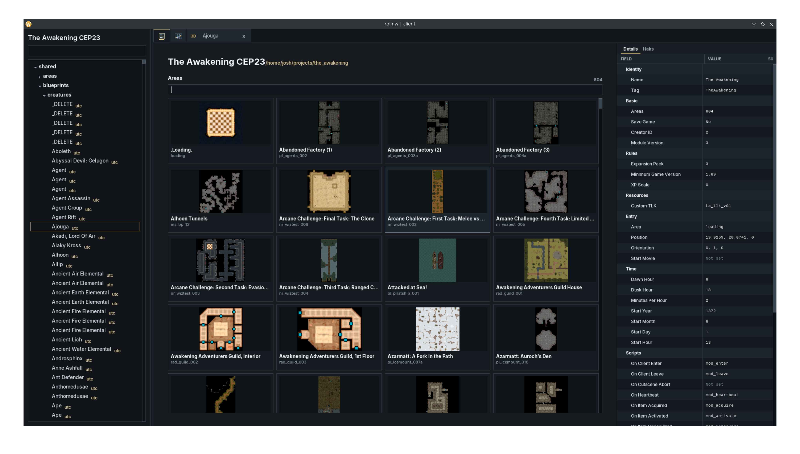
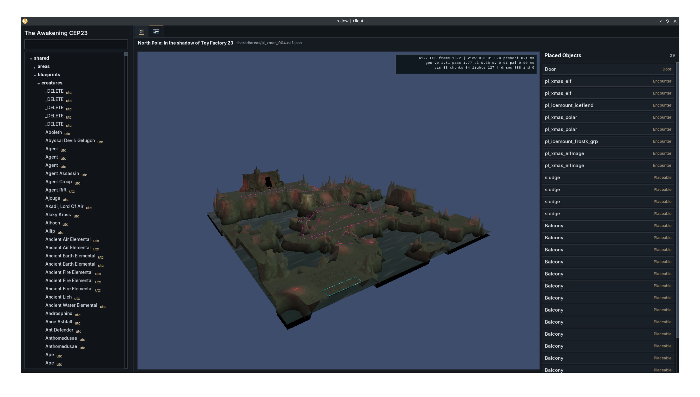
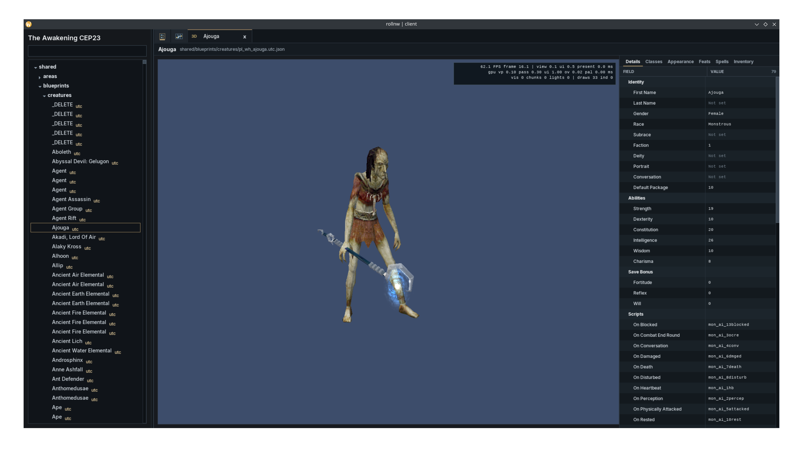

# rollnw | client

rollnw client is rollnw's local-first Neverwinter Nights module viewer and
authoring workbench. It imports a module into a project, presents resources in
workspace tabs, renders areas and blueprints through the shared viewer, and
exposes the selected live object to focused Details surfaces, Smalls scripts,
the terminal, and the command palette.

[Watch the rollnw-client demo on YouTube](https://youtu.be/1zftndVT2Is).

The integration target is a trustworthy viewer with bounded, explicit editing
paths. It is not a complete replacement for every NWToolset workflow. New
editors are added when their input, mutation, undo, persistence, and preview
contracts are all defined.

rollnw client is currently one process with one SDL event loop, one kernel Smalls
runtime, local project files, and a local renderer. The renderer presents live
objects; it does not own a second gameplay or editor object model.

## Screenshots

[](screenshots/module_view_2026_08_12.png)

*Module viewing with project-resource navigation and area minimaps.*

[](screenshots/area_view_2026_08_12.png)

*Area viewing with project-resource navigation and the complete placed-object list.*

[](screenshots/creature_view_2026_08_12.png)

*Creature blueprint preview with shared Details and focused editor tabs.*

## Importing A Module

On the Home tab, click **Import Module...**. Browse for the source `.mod` and a
destination parent folder, review both paths, then click **Import**. An animated
progress bar shows that import is running (it does not estimate a percentage).
The client creates a new folder named after the module and imports it in the
native JSON format. Existing folders are never
overwritten by this workflow. **Open Project...** opens an already imported project.

You can keep working during import. On success, the project opens automatically
unless you have unsaved changes or switched projects; it is also added to Recent
Projects. Wait for import to finish before quitting. If import fails, the error
dialog identifies the output folder and `import.log`; partial output is kept
there for inspection. Canceling either file picker writes nothing.

For scripting or legacy imports, the command line remains available:

```text
rollnw-client import (--json|--legacy) <module.mod> [project-dir]
```

Use `--json` for the client's native project format:

```sh
./rollnw-client import --json \
  "/path/to/Neverwinter Nights/modules/example.mod" \
  ./example-project
```

Quote paths that contain spaces. If `project-dir` is omitted, the client creates
a directory named after the module in the current working directory. For
example, importing `example.mod` without a destination writes to `./example`.

The JSON import creates `rollnw.json`, converts supported module resources to
JSON, combines each area's ARE/GIT/GIC resources into one CAF file under
`shared/areas/`, and generates area maps under `.rollnw/cache/area_maps/`.
The NWN:EE installation and every hak named by the module must be discoverable;
if automatic discovery fails, set `NWN_ROOT` and `NWN_HOME` to the installation
and user directories. Import fails when a declared hak cannot be loaded.

To preserve the module's original binary GFF resources instead, use:

```sh
./rollnw-client import --legacy "/path/to/example.mod" ./example-legacy
```

With the command line, the destination is created when it does not exist.
Importing into an existing project updates files in place and does not remove
unrelated or stale files, so use a new or empty destination when a clean import
is required.

## Runtime Shape

The common data flow is:

```text
project/module resource
    -> ToolsetBackend command
    -> WorkspaceState tab
    -> ResourceDocument or live ObjectHandle
    -> ViewerSession
    -> selected active_object
    -> property and managed-view snapshots
```

User actions from menus, shortcuts, the command palette, terminal, RmlUi, and
Smalls converge on `CommandBus`. A command returns one `CommandResult` with a
status, diagnostic channel, optional undo action, and optional prompt. The
command source does not get a separate mutation path.

The main ownership boundaries are:

| Owner | Data and lifetime |
| --- | --- |
| `ToolsetBackend` | Command registry, project/module state, terminal dispatch, and document-save commands. |
| `WorkspaceState` | Ordered tabs, live documents, active tab, dirty flags, subtabs, and per-tab undo/redo stacks. |
| `ViewerSession` | The loaded preview scene and renderer-side selected object handle. |
| `ObjectManager` | Live gameplay object storage addressed by generational `ObjectHandle` values. |
| `RmlSmallsBridge` / `SmallsRmlUiHost` | Non-owning active-object and active-area handles used by Smalls commands. Stale handles read back as invalid. |
| RmlUi documents | Presentation elements and document-scoped inline or external Smalls modules. |

`active_object` and its area command context are deliberate singleton
exceptions. rollnw client has one active workspace surface, one displayed area, and
one preview selection. The values are non-owning generational handles; changing
tabs, clearing selection, reloading, or closing a scene clears or replaces them.

## Workspace

`WorkspaceState` owns a contiguous list of tabs. A tab records its identity,
kind, title, resource detail, dirty flag, optional subtabs, and undo/redo
stacks. Undo history belongs to the tab containing the edited document; global
commands do not add entries.

There is one pinned Area tab, alongside Home and the blueprint tabs. Visiting
another tab preserves the current area's edits and undo history. Selecting a
different area reuses the Area tab; unsaved changes prompt for Save, Discard,
or Cancel first. Home and Area cannot be moved or closed.

Use **Ctrl+S** to save the active document or **Ctrl+Shift+S** / **Save All** to
save every modified open document without switching tabs. Saving supports native
CAF areas and JSON blueprints. If a document cannot be saved, it stays modified
and the output identifies the failure; other documents still save. Binary
resources are not overwritten with JSON.

Dirty tabs use a complete close protocol:

```text
workspace.close_tab
    -> clean: close
    -> dirty: Save / Discard / Cancel prompt
        -> Save: workspace.save_and_close_tab
            -> workspace.save_tab
            -> close only when save succeeds
        -> Discard: forced close
        -> Cancel: no command
```

`Ctrl+W`, palette actions, and terminal commands all dispatch this protocol.
They do not close a dirty document directly.
Quitting offers Save All, Discard, or Cancel. Save or discard modified documents
before opening another project or module.

## Commands

`CommandBus` is the application action boundary. `CommandSpec` supplies stable
IDs, aliases, scope, flags, default bindings, and usage text. The palette and
terminal enumerate the same specifications that scripts execute.

Command scopes are:

- `global`: application or navigation state; never pushed to a tab undo stack.
- `workspace`: document operations; a successful result may contribute one
  `CommandUndoAction` to the active tab.
- `renderer`: renderer or viewport state.

`CommandStatus::success` and `CommandStatus::noop` are successful results.
Only `success` results with an undo action, a workspace scope, and
`record_undo == true` are pushed to undo history. New undo actions clear the
tab's redo stack.

Smalls uses `core.commands.v1.command_execute`, so RmlUi handlers, scripts,
the terminal, and native widgets reach the same command handlers. See
[transactions](docs/transactions.md) for the current mutation, undo, dirty,
and save contracts.

## Viewer And Workbench

Blueprint previews instantiate one live object and areas retain one live root
area plus their contained objects. The viewer publishes the selected live
object without copying gameplay state into the renderer or UI.

The object workbench reads live Smalls propsets and native facts into bounded
presentation snapshots. The default Details surface is shared across placed
object types; workflow-heavy data opens a focused surface:

- creature appearance, body parts, and PLT colors;
- creature classes, feats, spells, inventory, and equipment;
- item state and item properties; and
- module details and hak inspection.

These views demonstrate the intended split: reflection handles broadly useful
data, while workflow-heavy collections use purpose-built views and commands.
All data-dependent row surfaces must remain viewport-virtualized.

Area tabs provide mesh or authored-footprint selection for placed
objects, Ctrl-click tile selection, a complete placed-object list, and camera
focus on list selection. The validated Creature/Placeable/Item structural slice
supports placement, transforms, duplicate, delete, undo/redo, and native CAF
save. Blueprint preview tabs use the same focused edit commands and save path.

New Blueprint presents a compact action list for Creature, Door, Encounter, Item,
Placeable, Sound, Store, Trigger, and Waypoint blueprints, then opens the saved
editor document. Every creation form asks for a ResRef, directory, and display
name. New Creatures use separate required first-name and optional last-name
fields and also prompt for race and class; NWN1 Smalls derives
appearance, ability scores, level-one class data, skills, and body parts from
those selections. Items require a base-item type. Base Item Type is currently
read-only in the workbench. Further authoring uses the existing object editor.

Blueprint forms and progress dialogs share the command overlay drawn after the
native viewport, with modal focus and input routed to that overlay.

Save as New Blueprint prompts for a ResRef and directory, copies the selected
authored object, changes its ResRef, and saves it. Blueprint files and their
temporary editor copies do not retain an instance UUID. The
temporary copy is destroyed and the project tree refreshes; the source selection,
tab, and dirty state remain unchanged. Names share the module's typed resource
namespace across directories. Ctrl+Z deletes the created file; Ctrl+Y restores the
same saved bytes. Undo rejects a subsequently changed file, and redo rejects a
resource-name collision. Close an open copy's editor tab before undoing creation.

Update Blueprint References offers Current Area or Whole Module. Matching live
instances of all nine authored object types are instantiated from the saved
blueprint, attached in their existing
area/inventory/equipment slots, and the old instances are destroyed. Placement,
UUID, container positions and unrelated edits survive. Preparation advances one
live instance per frame with progress and cancellation. Applying clears the area's
old handle-based history and leaves the area dirty; it does not write its file.
Whole Module also updates unopened documents through the isolated file worker.
Restore Original Files covers that worker's writes, excluding the live area.

Drag a Creature, Placeable, or Item blueprint from the project tree into an area
to preview placement; drop commits one undoable edit and cancel discards it.
Creature placement/transforms require walkable ground and known clearance:
invalid targets reject rather than snap, with a navigation overlay during drag.
Placeables and items allow free authored height within area XY bounds.

Ground items align their rotated model bottoms to authored height without
rewriting saved coordinates. Thin items have six-pixel sampled click assistance,
respecting nearer geometry. Selecting keeps the viewport stable; moving requires
a five-pixel drag, and viewport/camera changes cancel the gesture. Standalone
and equipped-item poses are unchanged.

Area drops create new instances from blueprints. Moving an existing inventory
item into the world and picking up ground items are not supported yet.

## Play Preview

Press F9 in an active area tab to enter the transient play preview. The first
use opens the project tree to choose a Creature blueprint; the project-relative
choice is persisted in `rollnw.json`:

```json
{
  "preview": {
    "test_actor": "shared/blueprints/creatures/example.utc.json"
  }
}
```

The actor is detached from authored area membership. Preview movement therefore
does not dirty the project or create undo entries, and it does not run scripts,
encounters, combat, persistence, or lifecycle events. F9 or Escape removes the
actor and returns to the unchanged editor selection and camera.

Move with WASD or the controller left stick, orbit with the right mouse button
or controller right stick, and zoom with the wheel, triggers, or shoulder
buttons. Left-clicking an area surface requests a path to that point.

## Appearance Ownership

Appearance editing has one mutation path even though the UI catalogs join two
data sources:

```text
native appearance tables          profile Smalls config/state
  model, model type, labels         NWN rules, propsets, body parts, colors
              \                    /
               nwn1 visual resolution
                        -> copied visual rows
                        -> shared renderer
```

Native creature/placeable tables provide engine-loaded facts and localized
catalog labels. `nwn1.appearances`, `nwn1.creature_state`, and
`nwn1.creature` own NWN interpretation, live appearance state, validation, and
visual resolution. Client edits invoke that profile API through the command and
undo path. The renderer receives resolved rows; it does not read profile
propsets or choose an appearance. Wing and tail catalogs are tool projections
of profile config, not a second state owner.

## RmlUi And Smalls

RmlUi owns layout and presentation. Smalls provides document behavior through
typed event snapshots and a bounded list of UI commands. Resource mutation
must go through `core.commands.v1`, not through RmlUi element operations.

The UI subsystem and language binding are documented in:

- [tools/ui](../ui/README.md)
- [RmlUi/Smalls binding](../ui/docs/rml_smalls.md)

## Source Map

- `main.cpp`: SDL/RmlUi event loop, document rendering, active-object
  publication, save callback, and shell integration.
- `toolset_backend.*`: project/module state and native command registration.
- `command_bus.*`: command protocol and undo-action admission.
- `workspace.*`: tabs, dirty state, close decisions, and per-tab undo/redo.
- `object_edits.*`: validated live-object patch and area-membership batches,
  undo ownership, and rollback.
- `resource_document.*` / `object_document.*`: resource identity,
  presentation, serialization, and atomic JSON replacement.
- `viewer_viewport.*` / `renderer*`: shared viewer integration and viewport
  presentation.
- `ui/panel.rml` / `ui/panel.rcss`: current shell document and styling.

## Current Limits

- The client is viewer-first. It does not yet provide new-area creation or a
  complete editor for every object aggregate.
- Native CAF area save is implemented. Structural placement and membership
  editing are currently limited to Creature, Placeable, and Item; other placed kinds
  are selectable and inspectable but do not all have structural commands.
- Encounter spawn lists require a dedicated editor; they are not flattened into
  generic Details rows.
- Save All covers open modified JSON area and blueprint documents; it is not
  autosave or a project-wide export.
- The Smalls list host defines list state and callback protocols, but the
  current object-workbench DOM rows are materialized by the C++
  `VirtualListController` path.
- Toolset presentation is packaged separately from profile policy, but runtime
  toolset-package replacement and hot reload are not implemented.
- There is no network server or serializable transaction protocol. Current
  object handles, Smalls type IDs, and undo closures are process-local.
