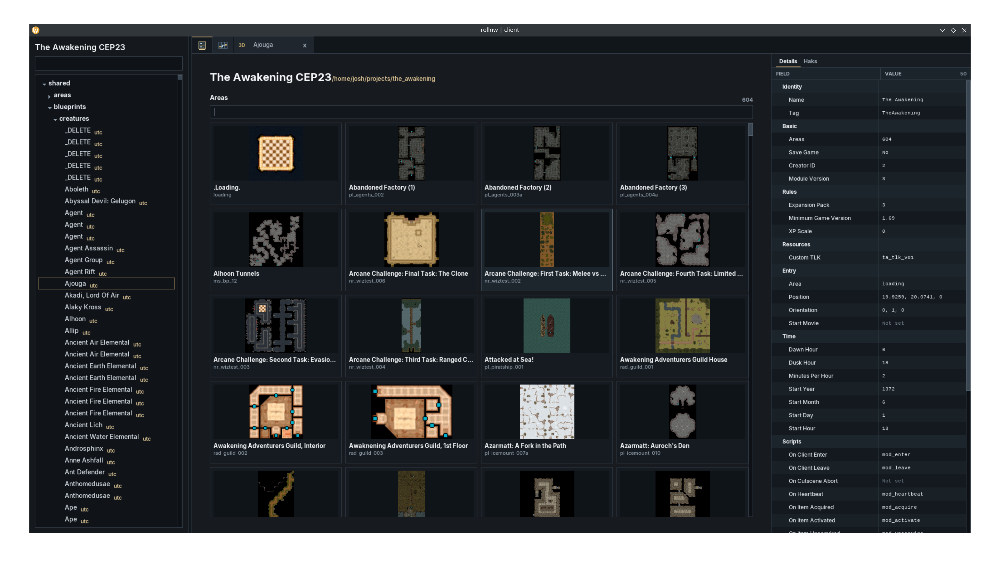
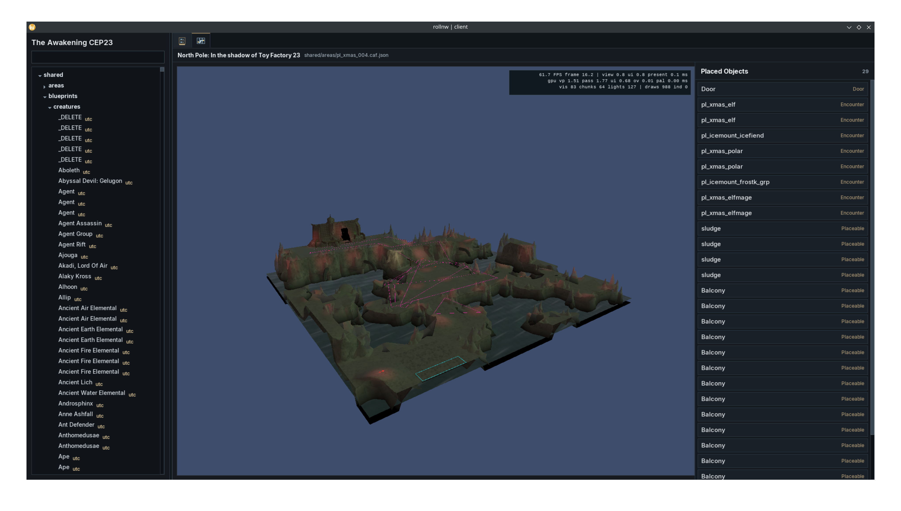
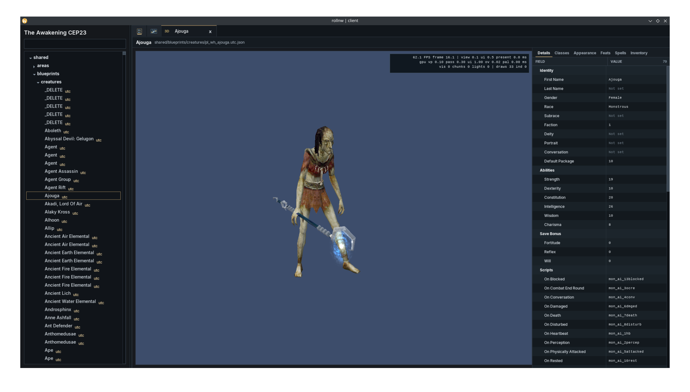

# rollnw | toolset

`rollnw | toolset` is a Neverwinter Nights module viewer and authoring tool,
installed as `rollnw-client`. Import a module into a local project, explore its
areas and resources, and edit objects and terrain with previews, undo, and save.

[Watch the overview demo](https://youtu.be/1zftndVT2Is) or the
[area-editing demo](https://youtu.be/PvT9pjiYuU0).

## Getting started

The client runs on Linux and Windows. See the root README for
[build and launch instructions](../../README.md#import-and-open-a-module-project).
You need an NWN:EE installation and the module's required hak files. If they
aren't found automatically, set `NWN_ROOT` to the installation directory and
`NWN_HOME` to the NWN user directory.

1. Launch `rollnw-client` and choose **Import Module...** on Home.
2. Select a `.mod` file and a destination parent folder, then click **Import**.
   The client creates a new project folder named after the module; this workflow
   does not overwrite an existing folder.
3. Open areas and blueprints from the project browser. Use **Open Project...**
   or Recent Projects to return to an imported project later.

You can continue working during import. The imported project opens automatically
when your current work allows it; otherwise, it is available in Recent Projects.
Wait for import to finish before quitting. Failed imports retain their output
folder and `import.log` for troubleshooting.

Projects use native JSON resources, with each area's data combined into a CAF
file. The source module is kept separate from the editable project.

## Workspace

Home provides project navigation and area maps. Areas open in a pinned Area tab;
blueprints and other resources open in their own tabs. Switching tabs preserves
your edits, and undo/redo belongs to the document being edited. Opening another
area reuses the Area tab and prompts if the current area has unsaved changes.

Select an object in the viewport or placed-object list to inspect it. The
workbench combines general **Details** with focused editors for appearance,
creature progression, item properties, inventory, and other supported data.
The command palette exposes actions, and the terminal provides command and
Smalls access.

| Shortcut | Action |
| --- | --- |
| Ctrl+Shift+P | Open the command palette. |
| Ctrl+S | Save the active document. |
| Ctrl+Shift+S | Save all modified open documents. |
| Ctrl+W | Close the active closable tab. |
| Ctrl+Z / Ctrl+Y | Undo / redo. |
| Ctrl+J | Toggle Output. |
| Backtick | Toggle the terminal. |
| F9 | Enter or leave play preview. |

Saving supports native CAF areas and JSON blueprints. Closing modified documents
or quitting offers Save, Discard, or Cancel. Failed saves keep the affected
documents open and modified; Save All still attempts the other documents.
Save or discard your changes before opening another project or module.

## Editing areas

Choose **Area** from the project browser's **+** menu, or **New Area...** from
the command palette. Supply a resource name (ResRef), directory, display name,
tileset, and dimensions. New areas can be 2–32 tiles wide and high and open in
the Area tab. **Delete Area...** permanently removes the active native area
resource; deletion has no undo.

The viewport supports placement, movement, duplication, and deletion of
Creatures, Doors, Encounters, Items, Placeables, Sounds, Stores, Triggers, and
Waypoints. These edits support undo/redo and CAF save. Drag Creature, Placeable,
or Item blueprints from the project tree to preview and place new instances.
Creatures require walkable ground; Placeables and Items allow authored height
within the area's bounds. Doors snap to compatible, unoccupied tileset hooks.

Encounter spawn-point markers can be added, moved, or removed in the area.
Sound objects show a selectable radius; use the mouse
wheel with a selected Sound to adjust its maximum radius.

### Terrain and tiles

Open the **Tiles** tab to paint terrain, features, tileset groups, elevation,
and crossers. The preview shows the proposed placement before you commit it.
Raise/Lower changes terrain height; crossers are placed on tile edges.

Groups are edited as complete footprints. Replacing or erasing a group also
handles doors attached to affected tiles, and undo restores them together.
Invalid operations leave the area unchanged and report the failure in Output.

| Input | Action |
| --- | --- |
| Left click or drag | Paint; raise with Raise/Lower selected. |
| Shift + left click | Select a tile or its complete group. |
| Shift + right click | Select a tile and cycle a compatible variation. |
| Right drag | Orbit the camera; lower with Raise/Lower selected. |
| Middle drag | Pan. |
| Mouse wheel | Zoom. |
| W / A / S / D | Move the camera relative to its view. |
| Q / E | Move the camera down / up. |
| Arrow keys | Orbit and tilt around the camera focus. |
| R | Rotate the selected feature or group preview. |
| Escape | Clear the tile selection or cancel the current action. |

## Blueprints and object editing

The project browser's **+** menu creates Creature, Door, Encounter, Item,
Placeable, Sound, Store, Trigger, and Waypoint blueprints. Forms ask for a ResRef,
directory, and display name. Creatures also need a race and class; Items need a
base-item type. Continue editing in the new blueprint's workbench.

Focused editors cover creature appearance, classes, feats, spells, inventory,
and equipment, as well as item appearance and properties. Encounter **Spawns**
and Sound **Sounds** support adding and removing entries; Sound entries can
also be reordered by dragging.

**Save as New Blueprint** creates a copy of the selected object without changing
the original. Resource names must be unique for their type across project
directories. Creation supports undo/redo; close the new blueprint's editor tab
before undoing its creation. Undo and redo reject conflicting file changes.

**Update Blueprint References** replaces matching instances from a saved blueprint
in the **Current Area** or **Whole Module**, preserving their placement and
container positions. Applying to an open area clears its previous undo history
and leaves it modified for you to save. **Restore Original Files** restores
updates made to unopened documents; it does not restore the live area.

## Play preview

Press **F9** in an area to try movement with a test Creature. On first use,
choose a Creature blueprint from the project tree; the choice is remembered
for that project. Preview movement does not modify the authored area.

Move with WASD or the controller's left stick, orbit with the right mouse button
or right stick, and zoom with the wheel, triggers, or shoulder buttons.
Left-click an area surface to request a path there. **F9** or **Escape** ends
preview and restores the editor selection and camera.

This is a movement preview. Scripts, encounters, combat, and gameplay
persistence do not run.

## Command-line import

```sh
rollnw-client import --json "/path/to/example.mod" ./example-project
rollnw-client import --legacy "/path/to/example.mod" ./example-legacy
```

Use `--json` for editable native projects. `--legacy` preserves the module's
original binary GFF resources. If the destination is omitted, it defaults to
the module name in the current directory. Relative paths are resolved from the
working directory; quote paths containing spaces.

Unlike the Home import workflow, command-line import can update an existing
destination in place. It does not remove stale or unrelated files, so use a new
or empty directory for a clean import.

Run `rollnw-client --help` for CLI usage, or `--version` and `--build-info` to
identify the build. Keep the executable with its packaged assets when moving
an installation.

## Current limits

- Editing does not yet cover every object field or NWToolset workflow.
- Individual Encounter spawn fields are not editable yet; spawn-point markers
  can be edited in the area viewport.
- Moving inventory Items into the world and picking up ground Items are not
  supported. Area drops create new instances from blueprints.
- Save All saves open modified native documents. It is not autosave or a
  project-wide export, and binary resources are not overwritten with JSON.

## Screenshots

[](screenshots/module_view_2026_08_12.png)

[](screenshots/area_view_2026_08_12.png)

[](screenshots/creature_view_2026_08_12.png)

## Development

The client uses SDL, RmlUi, Smalls, and the shared rollnw renderer. UI actions,
shortcuts, and scripts share command handlers and document undo history.

- [Application entry and lifecycle](client_application.cpp)
- [Commands and document transactions](docs/transactions.md)
- [UI subsystem](../ui/README.md) and [RmlUi/Smalls binding](../ui/docs/rml_smalls.md)
- [Shared renderer](../../lib/nw/render/README.md)
