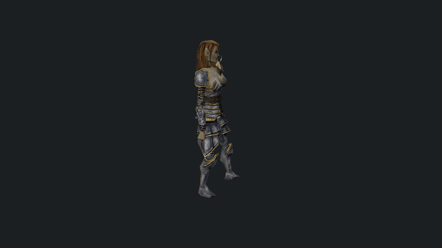

# mudl

`mudl` is a model viewer and headless capture tool for NWN assets plus glTF 2.0 / PBR content, including skinned and animated glTF playback.

It is useful for:
- interactive model inspection
- quick asset stats and hierarchy inspection
- deterministic screenshot capture
- deterministic turntable frame generation for downstream tooling



## Build

Requires:
- `ROLLNW_BUILD_RENDERER=ON`
- DXC runtime binaries via GitHub releases on Linux/Windows, or a system install on macOS

```bash
cmake --preset linux-renderer-dev
cmake --build --preset linux-renderer-dev --target mudl
```

## Quickstart

```bash
# Launch the interactive viewer
mudl

# Open a stock NWN model
mudl c_aribeth

# Open a glTF asset
mudl ./tests/test_data/renderer/DamagedHelmet/glTF-Binary/DamagedHelmet.glb

# Inspect model stats
mudl stats c_aribeth

# Print the viewer load report as JSON
mudl report c_halaster

# Headless screenshot
mudl screenshot c_aribeth ./out/c_aribeth.png

# Headless turntable image sequence
mudl turntable c_aribeth 36 --output ./out/c_aribeth
# Without --output, frames go to ./c_aribeth-turntable/

# Print the full command list
mudl help
```

## Common flags

Most commands accept these:

- `--module <path>`: load a module container (`.mod`, module directory, or zip) before resolving resources. Use this when the model, textures, or override assets live inside a specific module.
- `--user <path>`: use an explicit NWN user directory root for development/override resources. CI should use `--user ./tests/test_data/user`.
- `--animation <name>`: override the default animation for interactive/headless model previews.
- `--pbr-environment <ktx>`: select the HDR KTX source used by the static PBR `reference_ibl` policy.
- `--no-pbr-ibl`: skip generated static PBR IBL textures and use shader fallback lighting.
- `--dangly-scale <value>`: exaggerate or reduce dangly motion for tuning.
- `--dangly-mode legacy|modern`: choose the dangly simulation mode.
- `--validate`: enable Vulkan validation layers.
- `--debug`: enable the optional debug grid overlay.

Command-specific flags are listed inline below.

## Commands

### Interactive viewer

```text
mudl [<resref>]
mudl <path/to/model.gltf|model.glb>
mudl view [<resref>|model.gltf|model.glb|effect.json]
mudl creature <resref>
mudl item <resref>
mudl area <resref>
```

`mudl view` also opens a native particle asset directly when the input is a JSON file with `"$type": "ParticleEffect"` — this is the source-neutral authoring path for particle work.

```bash
mudl
mudl c_aribeth
mudl view c_aribeth
mudl view ./tests/test_data/user/development/particle_basic.json

# Static or skinned glTF / glb preview
mudl ./tests/test_data/renderer/DamagedHelmet/glTF-Binary/DamagedHelmet.glb
mudl ./tests/test_data/renderer/CesiumMan/glTF-Binary/CesiumMan.glb
mudl ./tests/test_data/renderer/MetalRoughSpheres/glTF-Binary/MetalRoughSpheres.glb

# Creature and item previews
mudl creature c_aribeth --animation pause1
mudl item nw_it_mpotion001

# Interactive area viewer
mudl area ttr01
```

### Headless capture

```text
mudl screenshot <resref> <path>
mudl turntable <resref> [frames] [--output <dir>]
mudl frames <count> [<resref>]
mudl area-screenshot <resref> <path>
mudl area-benchmark <resref> [--camera fit|gameplay|custom] [--camera-position x,y,z] [--camera-target x,y,z] [--visible-tile-radius <tiles>] [--no-local-shadows] [--no-forward-plus] [--forward-plus-gpu-cull] [--no-forward-plus-gpu-cull] [--forward-plus-auto-config] [--forward-plus-config tile,depth[,max]] [--forward-plus-debug off|cluster-lights|depth-slices] [--screenshot <path>]
mudl area-sweep <resref|area-list.txt> [--frames <count>] [--warmup <count>] [--variants minimal|default|all] [--no-local-shadows] [--no-forward-plus] [--forward-plus-gpu-cull] [--no-forward-plus-gpu-cull] [--forward-plus-auto-config] [--forward-plus-config tile,depth[,max]] [--forward-plus-debug off|cluster-lights|depth-slices] [--validate] [--json <path>]
mudl area --dump <module-path> [--output <path>] [--skip-existing] [--limit <n>]
```

Forward+ is enabled by default for local lights. Use `--no-forward-plus` only for
fallback or comparison captures. GPU gather is the default Forward+ path;
`--no-forward-plus-gpu-cull` forces the CPU reference path for parity runs.

```bash
# Single headless screenshot
mudl screenshot c_aribeth ./out/c_aribeth.png

# Turntable image sequence
mudl turntable c_aribeth 36 --output ./out/c_aribeth
# Defaults to ./c_aribeth-turntable/ when --output is omitted

# Render a fixed number of frames
mudl frames 36 c_aribeth

# Headless area screenshot
mudl area-screenshot ttr01 ./out/ttr01.png

# Headless area render benchmark from a gameplay-style camera
mudl area-benchmark ms_4city --camera gameplay --json ./out/ms_4city.json

# Compare the same fixed camera without local-light shadow maps
mudl area-benchmark ms_4city --camera gameplay --no-local-shadows --json ./out/ms_4city-no-local-shadows.json

# Simulate a game/PVS visibility mask around the camera tile
mudl area-benchmark ms_4city --camera gameplay --visible-tile-radius 2 --json ./out/ms_4city-near.json

# Capture a Forward+ cluster light-count heatmap after the benchmark
mudl area-benchmark ms_4city --camera gameplay --forward-plus-debug cluster-lights --screenshot ./out/ms_4city-fplus.png --json ./out/ms_4city-fplus.json

# Run the GPU Forward+ gather path explicitly for CPU/GPU parity captures
mudl area-benchmark ms_4city --camera gameplay --forward-plus-gpu-cull --forward-plus-debug cluster-lights --json ./out/ms_4city-fplus-gpu.json

# Compare a fixed Forward+ cluster layout against the automatic area config
mudl area-benchmark ms_4city --camera gameplay --forward-plus-config 32,4,64 --json ./out/ms_4city-fplus-fixed.json

# Run a validation sweep over area renderer variants
mudl area-sweep ms_4city --module ../the_awakening --frames 1 --variants default --validate --json ./out/ms_4city-sweep.json

# Run validation plus an area benchmark matrix and summary report
tools/mudl/area_benchmark_baseline.py ms_4city --module ../the_awakening --out-dir ./out/ms_4city-baseline --quiet

# Dump every area in a module to screenshots
mudl area --dump ./mymodule.mod --output ./out/areas --skip-existing --limit 50 --debug
```

### Inspection

```text
mudl stats <resref>
mudl report <resref|path>
mudl dump <resref> [--output <dir>]
mudl texture <resref> <path>
```

```bash
mudl stats c_aribeth
mudl report c_halaster
mudl report ./shared/blueprints/creatures/pl_bernard.utc.json --module ./mymodule.mod
mudl dump c_aribeth --output ./out/c_aribeth-assets
mudl stats c_aribeth --module ./mymodule.mod
mudl texture plc_archtarg plc_archtarg_d.png
```

`mudl report` resolves the NWN preview dependency graph without starting the renderer and writes the load report to stdout as JSON. It includes the preview source and kind, loaded model names, referenced resources, missing resources with model/node origins, particle emitter counts, particle caps, and report events. Supermodels are reported as MDL dependencies, but their mesh textures/materials are not treated as loaded preview resources. Redirect stdout to capture it cleanly:

```bash
mudl report c_halaster > ./out/c_halaster-report.json
```

`mudl dump` writes a self-contained resource closure for a model preview, including the model,
supermodels, reference models, mesh/emitter/light textures, TXI files, MTR files, and texture
references found inside TXI/MTR text. A `manifest.json` records copied and missing resources plus
the model node or secondary file that referenced each asset.

### Spells and VFX

```text
mudl spell <spells.2da rowid>
mudl spell-export <spells.2da rowid> <path>
mudl spell-export-live <spells.2da rowid> <path>
mudl spell-preview-live <spells.2da rowid> <path> [--frame <count>] [--view front|top|side] [--metadata]
mudl vfx <spell|resref|VFX_*|effect.json> [--stage proj|cast|conj|impact|duration|cessation]
```

```bash
mudl spell 115
mudl spell-export 115 ./out/spell115.json
mudl spell-export-live 115 ./out/spell115-live.json
mudl spell-preview-live 115 ./out/spell115-preview.png --frame 24 --metadata

mudl vfx VFX_IMP_MIRV
mudl vfx Fireball --stage impact
mudl vfx ./tests/test_data/user/development/particle_basic.json
```

### Particles

```text
mudl particle-preview <mdl-path|resref> <out.png> [--time <seconds>] [--view front|top|side] [--metadata]
mudl particle-preview-frames <mdl-path|resref> <out-dir> [--duration <seconds>] [--fps <n>] [--view front|top|side] [--metadata]
mudl particle-export <mdl-path|resref> <effect.json>
```

`--metadata` writes JSON companion files with emitter/kernel/warning state. `particle-preview` writes a sibling `.json` next to the PNG; `particle-preview-frames` writes `preview.json` plus one `.json` per numbered frame.

```bash
# Preview from a local MDL file
mudl particle-preview ./tests/test_data/user/development/vfx_lightning_test.mdl ./out/lightning.png --time 0.25 --metadata

# Preview from an NWN model resref
mudl particle-preview c_mindflayer ./out/c_mindflayer-particles.png --time 1.0 --view front --animation cspecial

# Frame sequence
mudl particle-preview-frames it_torch_000 ./out/torch-particles --duration 1.5 --fps 24 --view front --metadata

# Export an NWN particle effect into the native particle JSON format
mudl particle-export it_torch_000 ./out/it_torch_000.json
```

### Visual corpus and smoke tests

```text
mudl corpus <corpus.json> [--output <dir>] [--user <path>] [--pbr-environment <ktx>] [--no-pbr-ibl] [--limit <n>] [--filter <tag>] [--ledger <path>]
mudl nwn-animation-smoke [--user <path>]
mudl compute-smoke
```

```bash
# Run a checked-in corpus and collect per-entry outputs
mudl corpus ./tests/test_data/user/development/spell_corpus.json \
  --user ./tests/test_data/user \
  --output ./tmp/visual-audit/spells

# Run a corpus and update the checked-in visual audit ledger
mudl corpus ./tests/test_data/user/development/creature_corpus.json \
  --user ./tests/test_data/user \
  --output ./tmp/visual-audit/creatures \
  --ledger ./tests/test_data/user/development/visual_audit_ledger.json

# Run the checked-in DockerDemo area corpus through the test user directory
mudl corpus ./tests/test_data/user/development/area_corpus.json \
  --module ./tests/test_data/user/modules/DockerDemo.mod \
  --user ./tests/test_data/user \
  --output ./tmp/visual-audit/areas

# Run the Stage 2 PBR convergence baseline with static PBR reference IBL enabled
mudl corpus ./tests/test_data/user/development/pbr_corpus.json \
  --module ./tests/test_data/user/modules/DockerDemo.mod \
  --user ./tests/test_data/user \
  --output ./tmp/visual-audit/pbr \
  --ledger ./tests/test_data/user/development/visual_audit_ledger.json

# Renderer smoke test
mudl compute-smoke --validate
```

`mudl corpus --ledger <path>` updates a persistent audit ledger from the current run while preserving human review fields such as ownership, issue linkage, disposition, and review notes.

Viewer corpus entries may include a `camera` object when auto-fit is not a useful
diagnostic frame. Supported modes are `orbit`, `free`, and `area_gameplay`.
Use three-number arrays for `position` and `target`; `orbit` also requires a
positive `radius` plus optional `yaw`, `pitch`, and `fov`.

Static PBR corpus entries may include a `static_pbr_environment` object to pin
their reference lighting independently of the command line:

```json
"static_pbr_environment": {
  "environment_path": "tests/test_data/renderer/MetalRoughSpheres/glTF/papermill.ktx",
  "ibl_requested": true
}
```

Both fields are optional. Missing fields inherit `--pbr-environment` and
`--no-pbr-ibl`; malformed paths or non-boolean `ibl_requested` values fail the
corpus load.

Checked-in corpora:
- [particle_corpus.json](../../tests/test_data/user/development/particle_corpus.json) — canonical list of representative NWN particle models, required animations, and behavior classes when validating importer/runtime/render changes
- [spell_corpus.json](../../tests/test_data/user/development/spell_corpus.json)
- [creature_corpus.json](../../tests/test_data/user/development/creature_corpus.json)
- [item_corpus.json](../../tests/test_data/user/development/item_corpus.json)
- [model_corpus.json](../../tests/test_data/user/development/model_corpus.json)
- [pbr_corpus.json](../../tests/test_data/user/development/pbr_corpus.json) — focused Stage 2 PBR baseline covering glTF metal/roughness,
  NWN metal/specular fixtures, PLT/equipment, water-textured geometry, and an area local-light case
- [area_corpus.json](../../tests/test_data/user/development/area_corpus.json)
- [visual_audit_ledger.json](../../tests/test_data/user/development/visual_audit_ledger.json)

NWN MDL import gets you close, and native particle JSON gives you something clean to tune from there:

```bash
mudl view ./tests/test_data/user/development/particle_basic.json
```

## Output

`mudl` stops at deterministic frame generation. It does not own GIF or video encoding — that belongs in external tools like `ffmpeg` or build scripts that consume the generated PNGs.

```bash
# Generate a 36-frame turntable sequence
mudl turntable c_aribeth 36 --output ./out/c_aribeth
# Or omit --output to write ./c_aribeth-turntable/%04d.png

# GIF via ffmpeg
ffmpeg -framerate 12 -i ./out/c_aribeth/%04d.png -vf palettegen ./out/c_aribeth-palette.png
ffmpeg -framerate 12 -i ./out/c_aribeth/%04d.png -i ./out/c_aribeth-palette.png -lavfi paletteuse ./out/c_aribeth.gif

# MP4 via ffmpeg
ffmpeg -framerate 12 -i ./out/c_aribeth/%04d.png -pix_fmt yuv420p ./out/c_aribeth.mp4
```

## Viewer Controls

### General viewer

- `Left-drag`: orbit
- `Middle-drag`: pan
- `Mouse wheel`: zoom
- `F`: frame model to bounds
- `W` / `S` or `Up` / `Down`: pitch orbit
- `A` / `D` or `Left` / `Right`: yaw orbit
- `Q` / `E`: zoom out / in
- `P`: pause / resume the whole scene
- `.`: step the whole scene by 33 ms
- `/`: reset the whole scene
- `F5`: reload shaders and rebuild render pipelines
- `Tab`: cycle glTF animation clips
- `[` / `]`: scrub glTF animation time when an animated glTF is loaded
- `Space`: toggle autoplay for the active subsystem
- `J` / `K`: decrease / increase static PBR IBL strength
- `N` / `M`: decrease / increase static PBR exposure
- `Shift`: faster keyboard step
- `Esc`: exit viewer

### Area viewer

- `Left-drag`: free-look yaw / pitch
- `Middle-drag`: pan
- `Mouse wheel`: move forward / backward in perspective, zoom in orthographic overview
- `F`: frame area to bounds
- `W` / `S`: move forward / backward
- `A` / `D`: move left / right
- `Left` / `Right`: yaw
- `Up` / `Down`: move up / down
- `Ctrl` + `Up` / `Down`: pitch
- `Q` / `E`: zoom out / in
- `Shift`: faster keyboard step
- `Esc`: exit viewer

### Area lighting

These controls apply to exterior area previews with `day_night_cycle` enabled.

- `Space`: toggle day/night autoplay
- `[` / `]`: scrub backward / forward through time of day
- `\`: reset the cycle to the area's authored starting phase
- `G`: toggle authored area fog on / off
- `H`: toggle shadow cascade debug view

### Spell / VFX

- `Space`: toggle sequence autoplay
- `P`: pause / resume the whole scene
- `.`: step the scene by 33 ms
- `/`: reset the scene to time 0
- Debug panel support includes:
  `Sequence time` scrubbing, active-step inspection, per-step source / target metadata, and emitter isolation controls such as `Only ring` / `Hide ring`

## Features

- bindless sampled-texture rendering path
- per-draw uniform suballocation
- static and skinned mesh rendering paths
- static glTF 2.0 / PBR render path
- bind-pose skinned glTF render path
- glTF animation clip import and playback
- animated glTF playback now prefers the `Ozz` backend with a custom runtime fallback
- 3-point studio lighting for model and interior previews
- world-space exterior area lighting driven by area weather metadata
- smooth accelerated 45 second exterior day/night preview cycle
- cascaded directional shadows for area lighting
- camera auto-fit to world-space bounds
- interactive orbit/pan/zoom viewer controls
- unified scene pause / stop / reset / single-step controls
- spell and VFX sequence playback, export, and live preview tooling
- typed `progfx` lowering for programmable FX work in `mudl`
- interactive area navigation and lighting time controls
- headless screenshot capture
- headless area render benchmarks with deterministic overview, gameplay, or custom cameras
- Forward+ policy controls and cluster heatmap screenshots from the area benchmark path
- headless turntable frame output
- model hierarchy, geometry, and texture stats

## Reference

### Lighting notes

- Exterior areas use a stable world-space outdoor lighting rig instead of camera-relative studio lighting.
- Interior areas keep the viewer's studio-style lighting.
- Exterior areas with `day_night_cycle` enabled run through a full 45 second preview loop.
- Outdoor lighting uses authored `.are` sun/moon ambient and diffuse colors when present, with viewer fallbacks for missing or unusable values.
- Static PBR previews use the `reference_ibl` policy and split-sum IBL with:
  - HDR environment input
  - diffuse irradiance
  - GGX-prefiltered specular environment mips
  - BRDF LUT integration
- NWN models and areas use the `scene_authored` policy: area weather, wind,
  water, fog, and day/night lighting drive the scene instead of generated IBL.
- Static PBR previews expose viewer dials for the reference IBL path:
  - `J` / `K`: decrease / increase static PBR IBL strength
  - `N` / `M`: decrease / increase static PBR exposure
- The default static PBR reference environment is
  `tests/test_data/renderer/MetalRoughSpheres/glTF/papermill.ktx`; override it with `--pbr-environment <ktx>` for reproducible comparisons against another lighting source. Use `--no-pbr-ibl` for faster tool runs that do not need generated environment lighting.

### glTF notes

- `mudl` currently supports static `.gltf` / `.glb`, skinned glTF rendering, and imported glTF animation playback.
- The v1 static glTF path flattens node transforms into per-primitive world transforms.
- The current skinned glTF path retains the minimum node/skin data needed for bind-pose skinning and animation playback.
- The current animated glTF path runs through the renderer-owned animation runtime and prefers the `Ozz` backend for sampling.
- Current material support is focused on:
  - base color
  - normal
  - metallic-roughness
  - emissive
  - occlusion merged into the runtime ORM/surface texture at import time
- Current non-goals for the glTF path:
  - morph targets
  - exact Khronos Sample Viewer parity

### Regression set

Current graphics regression models:

- `c_aribeth`: humanoid character baseline
- `c_drgshad`: skinned creature with wing skinning
- `plc_archtarg`: placeable with emitters
- `ttd01_a04_03`: tile with static meshes, lights, and an aabb node
- `DamagedHelmet.glb`: static glTF / PBR baseline
- `CesiumMan.glb`: skinned glTF bind-pose baseline
- `MetalRoughSpheres.glb`: glTF metallic/roughness material baseline

Suggested checks:

```bash
mudl stats c_aribeth
mudl stats c_drgshad
mudl stats plc_archtarg
mudl stats ttd01_a04_03

mudl screenshot c_drgshad ./out/c_drgshad.png
mudl screenshot plc_archtarg ./out/plc_archtarg.png
mudl screenshot ttd01_a04_03 ./out/ttd01_a04_03.png
mudl ./tests/test_data/renderer/DamagedHelmet/glTF-Binary/DamagedHelmet.glb
mudl ./tests/test_data/renderer/CesiumMan/glTF-Binary/CesiumMan.glb
mudl ./tests/test_data/renderer/MetalRoughSpheres/glTF-Binary/MetalRoughSpheres.glb
```

## Design notes

- `mudl` is a consumer of `nw::gfx`, not a rendering framework.
- Headless capture is built in because it is part of rendering validation.
- Encoding stays outside the tool — `mudl` produces PNGs; `ffmpeg` and friends turn those into GIFs or videos.
- NWN assets still come first, but glTF / PBR is now the primary modern material path for renderer validation.
- Longer-term NWN1 preview/model compatibility notes live with the reusable runtime under `lib/nw/render/nwn/docs/`, not under the `mudl` app.
